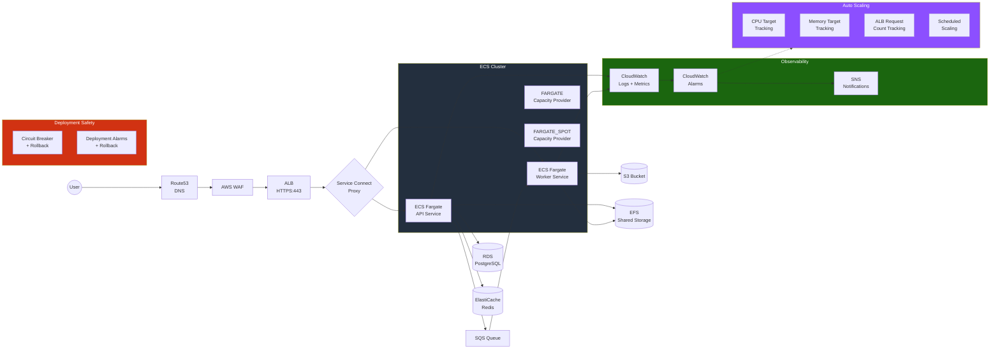
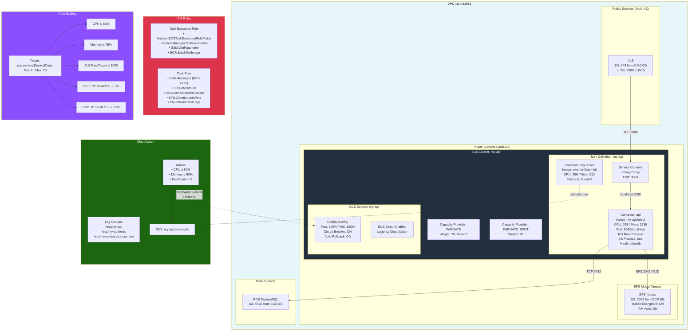
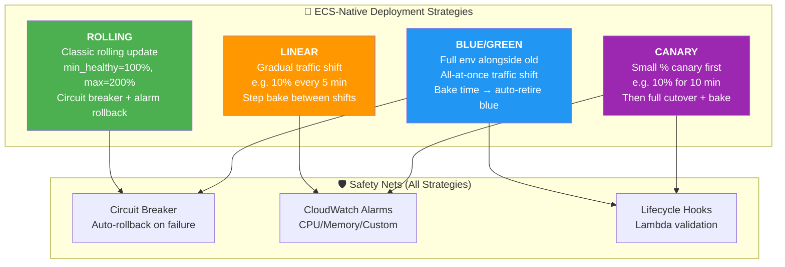
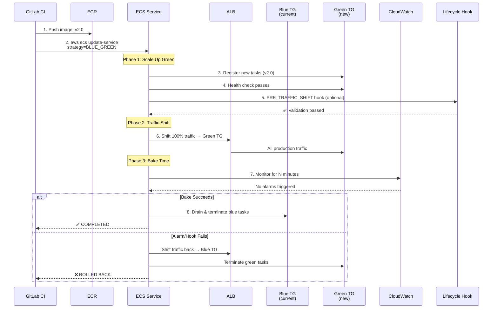
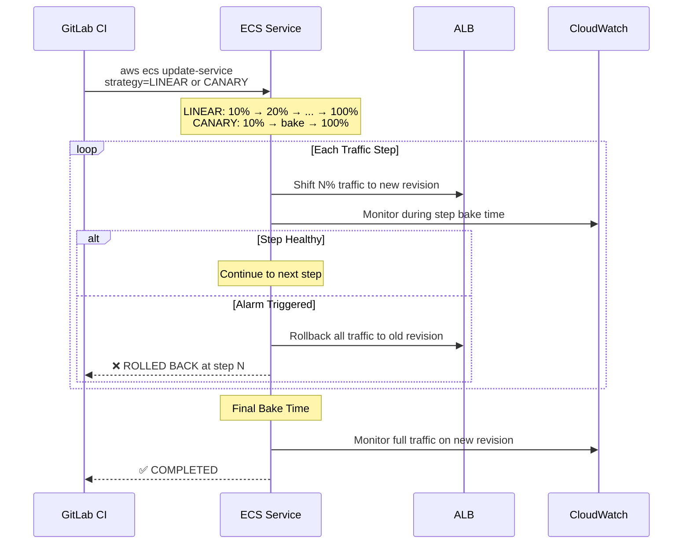
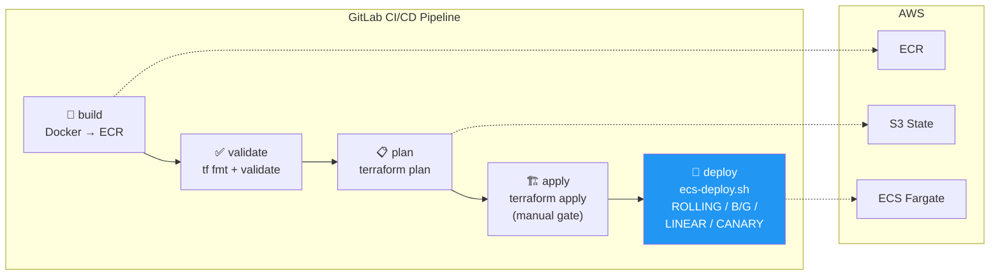

# Terraform AWS ECS Fargate Complete Module

> **A fully-packed, production-grade Terraform module for AWS ECS Fargate** covering every AWS ECS offering — ECS-native Blue/Green, Linear, and Canary deployments (provider >= 6.4.0), Service Connect, deployment circuit breaker, alarm-based rollback, auto scaling, EFS volumes, ECS Exec, FireLens sidecars, Graviton (ARM64) runtime, GitLab CI/CD pipeline, and CloudWatch observability.

## Features Covered

| AWS ECS Feature | Module Support | Variable |
|---|---|---|
| **ECS Cluster** | Create or use existing | `create_cluster`, `cluster_arn` |
| **Container Insights** | Enabled by default | `container_insights` |
| **Fargate + Fargate Spot** | Weighted capacity strategy | `capacity_providers`, `default_capacity_provider_strategy` |
| **Service Connect** | Full mesh config + TLS | `service_connect_configuration` |
| **Deployment Circuit Breaker** | Enable + auto-rollback | `deployment_circuit_breaker` |
| **Deployment Alarms** | CloudWatch alarm-based rollback | `deployment_alarms` |
| **Rolling Update Config** | min/max healthy percent | `deployment_minimum_healthy_percent`, `deployment_maximum_percent` |
| **🆕 Blue/Green (ECS-Native)** | Zero-downtime B/G with bake time | `deployment_strategy`, `blue_green_config` |
| **🆕 Linear (ECS-Native)** | Gradual % traffic shift | `deployment_strategy`, `linear_config` |
| **🆕 Canary (ECS-Native)** | Small % canary → full cutover | `deployment_strategy`, `canary_config` |
| **Green Target Group** | Auto-created for B/G/Linear/Canary | `create_green_target_group`, `green_target_group` |
| **GitLab CI/CD Pipeline** | Full pipeline + deploy script | `ci/.gitlab-ci.yml`, `scripts/ecs-deploy.sh` |
| **Auto Scaling — CPU** | Target tracking | `autoscaling.cpu_target` |
| **Auto Scaling — Memory** | Target tracking | `autoscaling.memory_target` |
| **Auto Scaling — ALB Requests** | Target tracking | `autoscaling.alb_request_count_target` |
| **Auto Scaling — Scheduled** | Cron-based scaling | `autoscaling.scheduled_actions` |
| **Auto Scaling — Step** | Step scaling policies | `autoscaling.step_scaling_policies` |
| **EFS Volumes** | With transit encryption + IAM auth | `efs_volumes` |
| **Bind Mount Volumes** | Sidecar sharing | `bind_mount_volumes` |
| **Docker Volumes** | Driver config | `docker_volumes` |
| **Ephemeral Storage** | 21–200 GiB | `task_ephemeral_storage_gib` |
| **ECS Exec** | Interactive debugging | `enable_execute_command` |
| **ARM64 / Graviton** | Runtime platform config | `runtime_platform` |
| **Container Health Checks** | In container definitions | `container_definitions[].healthCheck` |
| **Secrets Manager / SSM** | Secrets injection | `container_definitions[].secrets` |
| **FireLens (Fluent Bit)** | Log routing sidecar | `container_definitions[].firelensConfiguration` |
| **CloudWatch Logging** | Auto-injected per container | `create_cloudwatch_log_group` |
| **CloudWatch Alarms** | CPU, Memory, Task Count | `enable_cloudwatch_alarms` |
| **Load Balancer** | ALB/NLB target group binding | `load_balancer_config` |
| **Service Discovery** | Cloud Map DNS | `service_discovery` |
| **Security Group** | Auto-create with least privilege | `create_security_group` |
| **IAM — Task Execution Role** | ECR pull, Secrets, Logs | `create_task_execution_role` |
| **IAM — Task Role** | App permissions + ECS Exec | `create_task_role` |
| **Tagging & Propagation** | Service → Task propagation | `propagate_tags`, `enable_ecs_managed_tags` |

---

## Architecture Diagrams

### HLD — High-Level Design



### LLD — Low-Level Design



### Deployment Strategies — ECS-Native (Terraform provider >= 6.4.0)

> **No CodeDeploy required. 100% Terraform-native.** All strategies use the ECS service's
> built-in deployment engine via `deployment_configuration.strategy`.
> Just `terraform apply` — no AWS CLI workarounds.



### Blue/Green Deployment Flow



### Linear + Canary Deployment Flow



### GitLab CI/CD Pipeline Flow



### Strategy Selection Guide

| Criteria | ROLLING | BLUE_GREEN | LINEAR | CANARY |
|---|---|---|---|---|
| **Risk tolerance** | Medium | Low | Low | Lowest |
| **Rollback speed** | ~30s (new tasks) | Instant (traffic shift) | Instant | Instant |
| **Extra cost during deploy** | ~2x tasks briefly | 2x tasks + bake time | Gradual ramp | Minimal canary |
| **Validation approach** | Health check only | Bake time + hooks | Step monitoring | Canary monitoring |
| **Terraform support** | ✅ Native | ✅ Native (>= 6.4.0) | ✅ Native | ✅ Native |
| **AWS CLI / GitLab CI** | ✅ Full | ✅ Full (July 2025) | ✅ Full (Oct 2025) | ✅ Full (Oct 2025) |
| **Best for** | Dev / low-risk | Production APIs | Progressive rollout | Critical services |
| **Recommended env** | dev, staging | staging, prod | prod | prod |

> **💡 Recommendation:** Use `ROLLING` in dev/staging for fast iteration, `BLUE_GREEN` or `CANARY`
> in production for zero-downtime safety. Just change `deployment_strategy` in your Terraform
> variables — `terraform apply` handles everything, including ALB traffic shifting.

---

## Quick Start

### 1. Terraform — Provision Infrastructure

```hcl
module "ecs_fargate" {
  source = "path/to/terraform-aws-ecs-fargate-complete"

  name        = "my-api"
  environment = "prod"

  # Networking
  vpc_id     = "vpc-abc123"
  subnet_ids = ["subnet-1", "subnet-2"]

  # Container
  task_cpu    = 512
  task_memory = 1024

  container_definitions = [
    {
      name      = "api"
      image     = "123456789012.dkr.ecr.us-east-1.amazonaws.com/my-api:latest"
      essential = true
      portMappings = [{
        name          = "api"
        containerPort = 8080
        protocol      = "tcp"
        appProtocol   = "http"
      }]
      healthCheck = {
        command     = ["CMD-SHELL", "curl -f http://localhost:8080/health || exit 1"]
        interval    = 30
        timeout     = 5
        retries     = 3
        startPeriod = 60
      }
    }
  ]

  # Deployment Strategy — 100% Terraform-native (provider >= 6.4.0)
  deployment_strategy = "BLUE_GREEN"  # or ROLLING, LINEAR, CANARY

  # Bake time: monitor for 5 min after traffic shift before retiring old tasks
  bake_time_in_minutes = 5

  # Green target group for B/G traffic shifting
  create_green_target_group = true
  green_target_group = {
    port     = 8080
    protocol = "HTTP"
    health_check = {
      path = "/health"
    }
  }

  # ALB integration for B/G
  blue_green_config = {
    production_listener_rule = aws_lb_listener_rule.prod.arn
  }

  # Load balancer — Blue (primary) target group
  load_balancer_config = [{
    target_group_arn = aws_lb_target_group.blue.arn
    container_name   = "api"
    container_port   = 8080
  }]

  # Deployment Safety (all strategies)
  deployment_circuit_breaker = {
    enable   = true
    rollback = true
  }

  # Auto Scaling
  autoscaling = {
    enabled      = true
    min_capacity = 2
    max_capacity = 10
    cpu_target = {
      target_value = 70
    }
  }
}
```

### 2. GitLab CI — Build + Apply + Deploy

The pipeline builds the image, runs `terraform apply` (which sets the strategy natively),
then triggers a `force-new-deployment` to roll out the new image.

```bash
# Pipeline stages:
# build      → Docker image → ECR
# validate   → terraform fmt + validate
# plan       → terraform plan (includes deployment_strategy config)
# apply      → terraform apply (manual gate) — sets B/G/Linear/Canary natively
# deploy     → force-new-deployment (optional, for image-only updates)
```

### 3. Switching Strategies — Just Change the Variable

```hcl
# Switch to Linear: 25% every 5 min
deployment_strategy = "LINEAR"
linear_config = {
  step_percent              = 25.0
  step_bake_time_in_minutes = 5
}

# Switch to Canary: 10% canary for 10 min
deployment_strategy = "CANARY"
canary_config = {
  canary_percent              = 10.0
  canary_bake_time_in_minutes = 10
}
```

Then just `terraform apply` — ECS handles the rest.

---

## Module Structure

```
terraform-aws-ecs-fargate-complete/
├── main.tf              # All resources — ECS service with native deployment_configuration,
│                        #   green TG, ECS ALB service role, cluster, task def, IAM, SG, scaling
├── variables.tf         # Input variables — deployment_strategy, blue_green_config, linear_config,
│                        #   canary_config, lifecycle_hooks, bake_time_in_minutes
├── outputs.tf           # Resource ARNs, green TG, ECS ALB service role, deployment_strategy
├── versions.tf          # Terraform >= 1.5.0, AWS provider >= 6.4.0 (ECS-native strategies)
├── README.md            # This file — HLD/LLD diagrams, strategy guide, quick start
├── scripts/
│   └── ecs-deploy.sh    # 🔧 Emergency CLI deploy helper (for image-only updates outside TF)
├── ci/
│   └── .gitlab-ci.yml   # 🔄 GitLab CI/CD pipeline template (build → plan → apply → deploy)
├── examples/
│   └── complete/
│       └── main.tf      # Full-featured example with B/G, lifecycle hooks, ALB, EFS, Graviton
└── docs/
    └── RUNBOOK.md        # Operational runbook — deploy, rollback, incident response
```

---

## Requirements

| Name | Version |
|---|---|
| Terraform | >= 1.5.0 |
| AWS Provider | >= 5.40.0 |

---

## Definition of Done

- [ ] HLD approved by Solution Architect / CCoE
- [ ] LLD approved by peer review
- [ ] IaC merged to main branch with versioned release
- [ ] CI/CD pipeline green across all environments
- [ ] Monitoring dashboards created
- [ ] Runbook documented and accessible
- [ ] KT / handoff session completed
- [ ] Rollback procedure tested
- [ ] Tags and naming standards verified
- [ ] Security review complete
