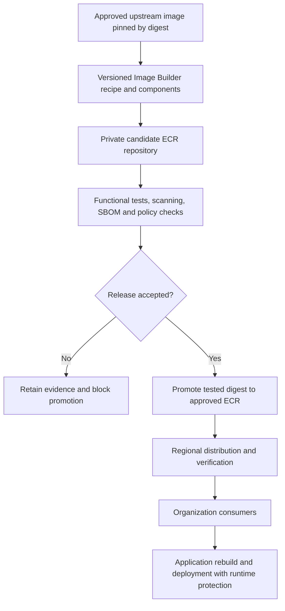

# Golden Container Image Factory — Plan and Open Questions

**Status:** Proposed design for Cloud Platform, Information Security and application-team review.  
**Primary account:** `prasanth-operations-prd`  
**Target Regions:** `us-east-2` and `us-east-1`  
**Workload environments:** Mixed ECS and EKS, including EC2-backed workloads and Fargate.  
**Current deliverable:** Planning documentation only. This document does not implement or deploy infrastructure.

## 1. Objective and success criteria

Extend the existing `Imagebuilder` repository into a centralized factory that produces enterprise-approved OS and runtime container images. Teams should consume a maintained base image with documented security requirements, provenance and a supported deployment pattern.

The factory must deliver:

- Repeatable Image Builder container pipelines using approved upstream sources.
- Golden **Amazon Linux 2023 (AL2023)**, .NET and approved Red Hat/UBI image families, with a process for additional third-party images.
- Reusable components for enterprise certificates, package sources, hardening, runtime configuration and build metadata.
- Candidate validation and controlled promotion into approved ECR repositories.
- Organization-wide consumption through private ECR access policies.
- A documented CrowdStrike and Tripwire security approach for each supported runtime.
- Rebuild, release, application-adoption, monitoring and rollback procedures.
- Standards and onboarding instructions suitable for the CITP Confluence standards area.

Two connected deliverables are required: **approved base images** and **approved runtime security integrations**. Installing a package in an image, or protecting the build host, does not demonstrate protection of a running application.

## 2. What exists in the repository

| Existing file or capability | Observed behavior | Implication for this feature |
|---|---|---|
| [main.tf](main.tf) | Terraform deploys CloudFormation resources for DataSync and optional Storage Gateway AMIs. | Reuse the orchestration pattern for a separate container factory. |
| [AWS-DataSync-AMI.yaml](AWS-DataSync-AMI.yaml) | Image Builder recipe for an appliance AMI; the documented design is copy-only. Production pipeline distribution includes organization launch permissions in both Regions. | Do not use this appliance as a general-purpose build host or add application security packages to it. |
| [AWS-StorageGateway-FILE-S3-AMI.yaml](AWS-StorageGateway-FILE-S3-AMI.yaml) | Lambda copies, encrypts, tags and shares appliance AMIs. It does not launch an Image Builder build instance. | Its AMI-copy workflow is separate from container building. |
| [variables.tf](variables.tf) | Inputs include network, KMS, organization and environment configuration. | Reuse naming conventions, but give the new factory its own explicit inputs. |
| [versions.tf](versions.tf) | Terraform `>= 1.5.0`; `hashicorp/aws >= 5.0`. | These are minimum constraints, not exact version pins. |
| Container factory resources | No container recipe, Platform ECR module integration or container promotion workflow was found in `Imagebuilder`. | These are new capabilities. |

The current AMI sharing configuration does not provide ECR access. Deployed AWS state, IAM effectiveness and vendor-console configuration were not inspected during this documentation review.

## 3. Proposed architecture and ownership

### 3.1 Repository structure and infrastructure ownership

Create a dedicated `Imagebuilder/container-factory/` area during implementation. Keep separate environment roots, reusable components, templates, tests and operational documentation beneath it.

Recommended ownership:

| Area | Owner and implementation approach |
|---|---|
| ECR repositories, encryption and lifecycle settings | Terraform through the mandatory Platform Team ECR module. |
| Image Builder components, recipes, infrastructure and pipelines | New CloudFormation templates orchestrated by Terraform, consistent with this repository. |
| ECR registry scanning and replication | The established registry owner; integrate with its existing configuration. |
| Promotion and release evidence | Factory automation with a dedicated promotion role. |
| ECS task definitions and EKS deployment integrations | Platform deployment modules and application delivery pipelines. |
| Sensor policies, licenses and security acceptance | InfoSec and the relevant product owners. |

Use separate state from the appliance stacks and separate production/non-production state. Avoid two resources, stacks or teams managing the same ECR repository policy or registry-level configuration.

**Tradeoff:** Keeping Terraform plus CloudFormation reduces migration work and follows the repository pattern, but validation must cover both layers. A Terraform plan for a stack wrapper is not sufficient evidence of every nested resource change. Native Terraform for the new Image Builder resources can be considered as a separate architecture decision before implementation; the proposed baseline retains the current pattern.

### 3.2 Build and promotion flow



Image Builder supports container recipes and regional ECR distribution. Configure its build output as a candidate; organization-wide publication happens after acceptance. [AWS container distribution documentation](https://docs.aws.amazon.com/imagebuilder/latest/userguide/cr-upd-container-distribution-settings.html)

The builder can write candidate images. A separate promotion identity can publish accepted releases. Normal consumers receive no access to candidate repositories. This prevents an incomplete scan or successful build alone from making an image an approved enterprise base.

Promote the tested artifact without rebuilding it. Verify the destination manifest digest. For multi-architecture releases, retain and verify the image-index digest and its platform manifests.

### 3.3 Build infrastructure

- Use supported enterprise EC2 build hosts with the required host-security baseline.
- Use private subnets, IMDSv2, encrypted build volumes and restricted IAM roles.
- Define approved connectivity to SSM, S3, ECR, logging, package mirrors, upstream registries and vendor endpoints.
- Use endpoints or approved proxy/egress paths as appropriate; a private subnet alone does not provide upstream access.
- Fetch credentials at execution time using scoped identities. Do not place secret values in Terraform inputs, CloudFormation metadata or component parameters.
- Retain sanitized build logs and terminate temporary build/test capacity according to the failure-handling policy.

The factory must distinguish protection of the temporary build host from protection of the container artifact and protection of deployed workloads.

## 4. Image families and reusable components

### 4.1 AL2023 golden container image

AL2023 is an explicit first-release image family. Start with the standard AWS-published AL2023 container image from `public.ecr.aws/amazonlinux/amazonlinux`.

Use an approved release and digest for each build. The floating `2023` tag may be checked for updates, but the resolved immutable digest must be recorded and used for a release. The standard AL2023 container image uses `dnf` for package installation. [AWS AL2023 container documentation](https://docs.aws.amazon.com/linux/al2023/ug/base-container.html)

Proposed repository name: `golden/al2023-base`, subject to Platform naming standards.

Plan the AL2023 build in this order:

1. Resolve and approve the upstream release, architecture and digest.
2. Configure approved package sources and install the approved package updates and additions.
3. Add the versioned enterprise CA bundle and update the system trust store.
4. Apply container-specific hardening, ownership and file permissions.
5. Provide a documented non-root application-user convention without assuming every downstream application uses the same UID or writable paths.
6. Remove temporary build material and package caches while preserving required runtime files and evidence metadata.
7. Run package, certificate, permission, scan and representative application tests.
8. Produce the package inventory/SBOM and release metadata before promotion.

Start with Linux `x86_64`. Add ARM64 after testing packages, application dependencies and the selected security integrations. Consider an AL2023 minimal variant later as a distinct family with its own package-manager and compatibility checks.

An AL2023 container is not an AL2023 AMI. Host kernel settings, boot services, SSH configuration and host agents must not be copied into a container-hardening checklist without establishing applicability.

### 4.2 .NET, Red Hat and third-party families

| Family | Planning requirements |
|---|---|
| .NET | Confirm runtime versions, runtime versus ASP.NET images, globalization/native dependencies, certificate trust and application startup. Keep SDK/build images separate from runtime images if required. |
| Red Hat/UBI | Confirm which product is required, approved sources, package access, subscriptions and redistribution rights. Do not assume UBI and every RHEL image have identical requirements. |
| Third-party | Establish provenance, vendor modification/support rules, redistribution rights, update cadence and whether customization is supported. |

Keep .NET as a separate family. An AL2023-based .NET variant requires explicit runtime support and application compatibility assessment; it is not implied by having both families in this feature.

### 4.3 Component design

Version components independently and compose only applicable components into each recipe:

- Approved package repositories and OS-family-specific package operations.
- Enterprise certificate installation and trust-store validation.
- Container-specific hardening and non-root execution conventions.
- Runtime-specific configuration and smoke tests.
- Metadata, package inventory and evidence generation.

Record component order and compatibility. Avoid one shared script containing every OS/runtime-specific condition. Pin the resolved upstream digest, recipe/component versions and source commit for each release.

## 5. CrowdStrike integration

### 5.1 Recommended deployment model

Prefer independently versioned sensor deployment over installing a sensor into every generic application base image.

| Runtime | Proposed integration | Required evidence |
|---|---|---|
| ECS on customer-managed EC2 | Supported Falcon host sensor using the enterprise host baseline. | Healthy host registration and demonstrated container-workload visibility. |
| EKS on EC2 | Supported Falcon node sensor, preferably managed through Helm/operator integration. | Node coverage, workload visibility and no duplicate sensor installation. |
| ECS Fargate | Supported Falcon initialization container and application entrypoint integration. | Successful initialization, instrumented application startup and Falcon telemetry. |
| EKS Fargate | Supported Falcon container injection through the appropriate Helm/operator configuration. | Injection coverage, supported pod configuration and Falcon telemetry. |

CrowdStrike publishes Kubernetes node/container deployment options. Verify the supported chart/operator and sensor versions for the actual cluster and OS matrix. [Falcon Helm charts](https://github.com/CrowdStrike/falcon-helm), [Falcon EKS Fargate integration](https://github.com/CrowdStrike/falcon-operator/blob/main/docs/deployment/eks-fargate/README.md)

Do not assume that customer-managed EC2 instructions also apply to every managed compute offering or immutable host OS. Include those variants in the inventory and support review.

### 5.2 What “sidecar” means for ECS Fargate

In the documented Falcon ECS Fargate pattern, an initialization container prepares sensor files on a shared volume. The application uses a wrapped entrypoint that starts the sensor in the application's execution context. A generic, unrelated sidecar does not establish equivalent visibility. [CrowdStrike ECS Fargate guide](https://github.com/CrowdStrike/Container-Security/blob/main/aws-ecs/ecs-fargate-guide.md)

Plan the integration in the Platform ECS deployment module:

1. Reference an approved, pinned Falcon container image.
2. Configure the shared sensor volume and initialization dependency.
3. Preserve application entrypoint and command behavior through the supported wrapper.
4. Configure required capabilities and writable mounts only where necessary.
5. Block application startup if mandatory sensor initialization fails.
6. Validate registration and detection in Falcon before accepting the deployment pattern.

CrowdStrike's Terraform example documents entrypoint wrapping, shared volumes and `SYS_PTRACE`. Review its implementation and failure behavior rather than copying examples without validation. [CrowdStrike Terraform ECS Fargate example](https://github.com/CrowdStrike/terraform-aws-ecs-fargate)

### 5.3 Packages, credentials and lifecycle

- Mirror approved sensor images into a separate private ECR repository only after confirming entitlement and redistribution rules.
- Pin sensor versions/digests independently from golden base images.
- Keep Falcon API and registry credentials in the approved secret-management system.
- Separate automation credentials used to retrieve packages from runtime enrollment/configuration requirements.
- Confirm customer IDs, grouping tags, vendor cloud, proxy settings and account/OU mapping with InfoSec.
- For EC2 images, use the vendor-supported golden-image preparation process so cloned instances do not inherit an existing host identity.
- Define telemetry-loss alerting and escalation separately from initialization failure behavior.

The proof of concept must test non-root execution, read-only root filesystems, startup, shutdown, CPU/memory overhead, architecture support and a vendor-approved detection exercise. A running process alone is insufficient acceptance evidence.

## 6. Tripwire integration and InfoSec decision

The exact Tripwire product, version and licensed capabilities are unknown. Do not assume the existing EC2 agent is supported inside an application container or as a sidecar. Public information reviewed does not establish that support for this environment.

| Option | Proposed position | Limitation or prerequisite |
|---|---|---|
| Agent on supported EC2 hosts | Retain host integrity monitoring. | Prove the monitored scope; host monitoring does not automatically cover every container file. |
| Agent inside application containers | Exception candidate for a specific family. | Vendor support, lifecycle, registration, licensing, privileges and overhead must be established. |
| Tripwire sidecar | Limited proof-of-concept candidate for explicitly shared paths. | Separate container filesystems restrict visibility. Mounts and product support must be validated. |
| Complementary container integrity controls | Present to InfoSec for control mapping. | They do not automatically replace the Tripwire requirement. |

### 6.1 Sidecar feasibility

Sharing task or pod networking does not expose the application container's root filesystem. A sidecar could potentially monitor a shared application-data or configuration volume, with appropriate mounts and vendor support. It cannot be described as monitoring all application binaries unless that coverage is actually demonstrated.

For the proof of concept:

- Specify every monitored path and whether it belongs to an image layer, ephemeral writable filesystem or persistent volume.
- Establish a trusted baseline after approved initialization, without accepting arbitrary runtime changes as trusted.
- Give each workload the identity required by the supported Tripwire deployment model.
- Test file addition, modification and deletion in a dedicated test path.
- Verify receipt of the event in the Tripwire management system.
- Record exclusions and the behavior when the agent, network connection or collector fails.

Do not reuse build-host identities, keys or baselines indiscriminately across cloned workloads. Exact preparation and registration commands must come from the selected product's supported documentation.

### 6.2 Proposed alternatives for assessment

Where a Tripwire container integration is unsupported, propose a combination of signed image verification, digest pinning, read-only root filesystems, controlled writable mounts, least privilege, runtime detection and supported persistent-data integrity monitoring.

InfoSec must map those controls to the required outcomes and explicitly accept any alternative or exception. Mandatory unresolved coverage blocks production acceptance; it must not be silently marked as satisfied.

## 7. ECR sharing across the organization

### 7.1 Central consumption model

Initially keep approved repositories in the Operations account and allow authorized organization consumers to pull directly.

- Constrain repository pull permissions with `aws:PrincipalOrgID`.
- Use approved `aws:PrincipalOrgPaths` where access should be limited to selected OUs and descendants.
- Grant only required pull actions; reserve push, promotion, policy changes and deletion for designated roles.
- Configure consumer identity permissions, including `ecr:GetAuthorizationToken` on `Resource: "*"` and repository-scoped reads.
- Test the role actually used to pull images: ECS execution/container-instance role as appropriate, EKS node role or EKS Fargate pod execution role.
- Validate SCPs, permission boundaries, endpoint policies and network access as part of the same test.

Repository permissions and caller IAM permissions both matter for cross-account access. Organization conditions must be evaluated against the actual principal and desired OU scope. [ECR repository policies](https://docs.aws.amazon.com/AmazonECR/latest/userguide/repository-policy-examples.html), [AWS global condition keys](https://docs.aws.amazon.com/IAM/latest/UserGuide/reference_policies_condition-keys.html)

Test new-account onboarding, an account outside the allowed scope, and account/OU movement. Review all policy statements so a separate broad allow does not undermine the intended boundary.

### 7.2 Regional replication and optional account copies

Propose `us-east-2` as the first build Region and `us-east-1` as a destination for approved releases. Pre-create destination repositories with the Platform ECR module and verify access, encryption, lifecycle and scanning settings in both Regions.

Confirm whether the Jira wording requires usable build pipelines in both Regions. Replication provides image availability; it does not provide an independently usable secondary build pipeline. If both pipelines are required, assign release ownership so independent builds cannot publish conflicting versions of the same release.

Use member-account copies only when ownership or isolation requirements justify their added cost and administration. Cross-account replication requires destination registry permissions. Pre-created repositories avoid relying on automatic creation with unintended defaults. [ECR replication documentation](https://docs.aws.amazon.com/AmazonECR/latest/userguide/replication.html)

Coordinate replication and scanning through one registry owner because those settings affect more than an individual factory repository. Define recovery for failed replication and backfill for releases that predate the configuration.

### 7.3 ECR encryption versus AMI sharing

ECR handles repository encryption through its KMS integration. Do not copy AMI snapshot key-sharing policies into the ECR consumer model. Configure regional ECR keys and preserve the grants needed by ECR. [ECR encryption documentation](https://docs.aws.amazon.com/AmazonECR/latest/userguide/encryption-at-rest.html)

Existing AMI distribution remains separate. If AMI sharing is extended later, encrypted AMIs need organization/OU launch permissions and access to the customer-managed keys protecting their snapshots. [AWS AMI organization sharing](https://docs.aws.amazon.com/AWSEC2/latest/UserGuide/share-amis-with-organizations-and-OUs.html)

## 8. Release policy, maintenance and observability

### 8.1 Candidate acceptance and promotion

Before promotion, require approved provenance, functional tests, certificate/package-source validation, a package inventory/SBOM and completed security scans. Include secret scanning and the required signature/provenance verification workflow.

Enable ECR enhanced scanning through the registry owner for candidate and approved repositories. Amazon Inspector covers supported OS and language packages; missing, unsupported or expired results must not count as passing. Scanning must feed an explicit promotion gate. [AWS enhanced scanning documentation](https://docs.aws.amazon.com/AmazonECR/latest/userguide/image-scanning-enhanced.html)

InfoSec must define severity thresholds, treatment of unfixable findings, exception expiry and emergency-release handling. Bind decisions and evidence to an exact digest. Proposed production behavior is to block promotion when mandatory evidence is absent or a required check fails.

Use immutable release tags and digest-based consumption. A release record should identify the upstream digest, final digest, architecture, source commit, component/recipe versions, test evidence and approval. Any signing implementation must verify that signatures and supporting artifacts are available to consumers in both Regions.

### 8.2 Rebuild and adoption process

Rebuild on an agreed schedule and when relevant upstream, certificate, package or security changes are approved. Assign an owner for new findings against already-published images.

Publishing a new base image does not patch existing application images or replace running workloads. Application pipelines must update their base digest, rebuild, test and deploy. Track adoption and unresolved exceptions rather than treating publication as completion of remediation.

Lifecycle policies must preserve releases needed by active deployments and rollback. Do not use simple age-based deletion as the only evidence that an image is unused. Agree retention periods, storage budgets and exception handling before enabling expiration.

### 8.3 Monitoring and evidence

Monitor build/test failures, failed promotions, replication failures, overdue rebuilds, expiring certificates, new findings and missing sensor coverage.

- Use CloudWatch logs/dashboards and EventBridge integrations where appropriate.
- Correlate events with build IDs and image digests in logs and release records.
- Keep metric dimensions bounded; avoid one metric series per digest or build.
- Configure missing-data behavior explicitly. Use a periodic freshness/health check where silence must be detected.
- Reuse organizational CloudTrail auditing and approved evidence storage instead of creating redundant audit pipelines.
- Route actionable operational alerts to the Platform owner and security coverage/findings to the relevant InfoSec owner.

Account for EC2 build minutes, registry storage/replication, Inspector scanning, network egress, endpoints, logs, KMS and vendor licensing when estimating costs. No numerical cost estimate is assumed in this document.

## 9. Open questions and owners

All answers below are prerequisites or decisions to record, not values to guess during implementation.

| ID | Open question | Owner | Required evidence or decision |
|---|---|---|---|
| Q01 | What is the Operations account ID and permitted deployment role? | Platform | Confirmed account/role mapping for each environment. |
| Q02 | Which Platform ECR module source/version and inputs are mandatory? | Platform | Accessible module contract and pinned version. |
| Q03 | Who owns registry scanning, replication and existing policies? | Platform | Single owner and integration approach. |
| Q04 | Which ECS/EKS compute types, OS families and architectures exist? | Platform/application teams | Inventory and representative test workloads. |
| Q05 | Which AL2023 release, packages, mirrors and CA bundle are approved? | Platform/InfoSec/certificate owners | Versioned AL2023 baseline and source digests. |
| Q06 | Which .NET versions and runtime base images are approved? | Runtime owners | Support and application compatibility matrix. |
| Q07 | What Red Hat/third-party modification and redistribution rights apply? | Product/licensing owners | Approved image and distribution scope. |
| Q08 | Which Falcon products, versions and container licenses are available? | InfoSec | Supported integration matrix and registry entitlement. |
| Q09 | Which Tripwire product/version is used, and what container models are supported? | Tripwire owner/vendor | Product-specific support confirmation. |
| Q10 | What exactly must Tripwire monitor? | InfoSec | Image files, writable paths, persistent data and required detection evidence. |
| Q11 | Which security privileges, exclusions and failure behaviors are accepted? | InfoSec/runtime owners | Approved startup, telemetry-loss and exception policy. |
| Q12 | Which organization/OUs, consumer roles and excluded accounts apply? | Platform | Policy scope and positive/negative test targets. |
| Q13 | Must builds run independently in both Regions? | Feature owner | Availability requirements and release-writer ownership. |
| Q14 | Which upstream/vendor endpoints and private services must be reachable? | Network/security teams | Approved connectivity and proxy/endpoints design. |
| Q15 | Which scan thresholds, signing controls and exceptions apply? | InfoSec | Digest-bound release policy with owners and expiry. |
| Q16 | Which CI system, remote backend and exact tool/provider versions are approved? | Platform | Reproducible execution configuration. |
| Q17 | What rebuild, remediation, retention and recovery targets apply? | Platform/application teams | Operational objectives and cost/retention policy. |
| Q18 | Who owns support, downstream adoption and CITP publication? | Platform/application teams | Named operational and documentation owners. |

## 10. Delivery phases and exit criteria

| Phase | Planned work | Exit criteria |
|---|---|---|
| 1. Discovery and standards | Resolve ownership, module contract, runtime inventory, AL2023 sources and security objectives. | Documented decisions and dependencies; unknown mandatory controls remain visible. |
| 2. Factory foundations | Establish isolated environment roots, ECR integration, build network/IAM, components and candidate pipeline. | A non-production pipeline runs with reviewed infrastructure and evidence retention. |
| 3. AL2023 pilot | Build the first AL2023 base and a representative application derived from it. | Package/certificate/hardening tests pass; provenance and scans are complete. |
| 4. Runtime and security pilot | Add .NET; exercise selected EC2-backed and Fargate integrations; assess Tripwire options. | Falcon coverage proven and InfoSec decision recorded for all mandatory integrity requirements. |
| 5. Sharing and promotion | Implement digest-bound promotion, organization access and regional publication. | Positive/negative pull tests and regional consistency pass; failed candidates cannot publish. |
| 6. Production operation | Add remaining approved families, rebuild/adoption automation, alerts and rollback procedures. | Owner sign-off, rollback demonstration, CITP standards and onboarding guidance. |

Security pilots should use dedicated test workloads and vendor-approved exercises. Factory delivery should provide reusable deployment patterns; updating all existing application services is a separately scheduled adoption activity with accountable owners.

## 11. Validation plan and acceptance evidence

### 11.1 Infrastructure checks

The following commands describe future implementation checks. Run them from the selected factory environment root after the files, lockfile and dependencies exist:

```bash
terraform fmt -check -recursive
terraform init -backend=false -lockfile=readonly
terraform validate
trivy config .
checkov -d .
```

Also scan reusable modules/templates outside that root. Validate new CloudFormation templates with `cfn-lint` and organizational CloudFormation Guard rules. For example, after the planned template and policy files exist:

```bash
cfn-lint ../../templates/golden-container.yaml
cfn-guard validate --data ../../templates/golden-container.yaml --rules ../../policy/imagebuilder.guard
```

After the approved non-production backend, variables and plan policies exist:

```bash
terraform init -reconfigure -lockfile=readonly -backend-config=backend.dev.hcl
terraform plan -var-file=dev.tfvars -out=factory.tfplan
terraform show -json factory.tfplan > factory.tfplan.json
conftest test factory.tfplan.json --policy ../../policy/terraform/
```

Protect plan files and JSON as sensitive CI artifacts. Review the rendered CloudFormation templates and nested resource changes in addition to the Terraform plan. Validate a matching CloudFormation change set where used for review, with one clearly designated execution path so both tools do not independently execute the same change.

Use the approved production environment's corresponding inputs for its own plan. Production execution requires reviewed artifacts and environment approval; do not regenerate an unreviewed plan in the apply stage.

### 11.2 Functional and integration scenarios

| Area | Required scenario and pass condition |
|---|---|
| AL2023 provenance | Final image traces to an approved AL2023 upstream digest and architecture. |
| AL2023 packages | Package inventory matches policy; only approved sources are used; package operations work during build. |
| Certificates | Representative enterprise TLS connection succeeds using the installed trust bundle. |
| Runtime behavior | AL2023-derived and .NET applications start, respond and terminate correctly. |
| Container hardening | User, permissions, writable paths and required security contexts are compatible and documented. |
| CrowdStrike | Vendor console shows expected coverage and a vendor-approved test event; sensor initialization failure blocks required startup. |
| Tripwire | Add/modify/delete tests on every claimed path produce expected evidence; exclusions are explicit. |
| Build confidentiality | No credentials or registration material in image layers/history, state, component logs or exported evidence. |
| Promotion | Failed or missing mandatory evidence prevents publication to approved repositories. |
| Organization access | Authorized member role can pull; unauthorized role/account cannot pull or push. |
| Regional delivery | Destination digest matches the accepted release; consumer role can pull in each required Region. |
| Rebuild and adoption | A base update produces a new release and a representative downstream application rebuild/deployment. |
| Rollback | Previous approved digest and deployment configuration restore a healthy, protected workload. |

Do not claim runtime behavior is validated by Terraform syntax checks or a successful image build alone.

## 12. Assumptions, risks and rollback

### 12.1 Terraform execution context and version floor

- **Runtime observed during review:** Terraform `1.15.8`, local `darwin_arm64`.
- **Existing configuration floor:** Terraform `>= 1.5.0` and AWS provider `>= 5.0`.
- **Exact provider version:** Not established for the `Imagebuilder` root; pin an approved selection and commit its lockfile during implementation.
- **State backend:** Not established. Use encrypted remote state with locking and separate environments; native S3 lockfiles require Terraform `>= 1.10` if selected.
- **Execution path:** Local read-only review for this document. Deployment CI/Cloud execution and approved runtime pins remain Q16.
- **Criticality:** Production service shared across the organization, introduced through a non-production pilot.
- **Feature guards:** Native Terraform tests require `>= 1.6`; mock providers require `>= 1.7` if those tests are selected. Keep secret material outside Terraform rather than assuming `sensitive = true` excludes it from state.

Do not combine an unreviewed provider/runtime upgrade with the feature rollout. The observed local runtime does not establish the production runner version.

### 12.2 Risks and chosen controls

| Risk category | Concern | Proposed control and tradeoff |
|---|---|---|
| Secret exposure | Credentials copied into layers, state, logs or cloned agent identity. | Runtime retrieval, scoped identities and artifact inspection; adds integration work. |
| Compliance gaps | ECR scanning or host-agent installation mistaken for complete runtime protection. | Separate control evidence for registry, host and workload; requires InfoSec/vendor participation. |
| Blast radius | Faulty release or broad sharing affects many accounts. | Candidate isolation, separate promotion role, phased consumers and digest pinning; adds a release stage. |
| CI drift | Different tool versions or apply using an unreviewed plan. | Pinned toolchain, committed lockfile and reviewed artifacts. |
| Provider upgrade risk | Open-ended constraints introduce unrelated behavior changes. | Explicit tested versions and a separate upgrade review. |
| Testing blind spots | Build success hides application, sensor or access failures. | Real integration tests on representative runtime/account combinations. |
| Identity churn/state corruption | New factory coupled to existing appliance state or duplicate ownership. | Isolated state, stable named resources and one owner per policy/configuration. |

### 12.3 Rollback and recovery

For a defective base release, suspend further promotion and restore the previous approved digest in the application build/deployment configuration. Rebuild the application from that retained base when necessary; changing a base reference alone does not alter an already-built application image.

For a defective sensor integration, restore the prior task definition, Helm/operator configuration or supported host release independently. Follow the agreed security-exception process if protection cannot be restored immediately.

Preserve the affected and previous release metadata, test results, approvals, source commits and relevant logs. Retain ECR artifacts, AMIs/snapshots where applicable and encryption keys needed for recovery. Avoid automatic deletion of rollback dependencies.

For infrastructure changes, revert configuration through a newly reviewed plan. Restoring Terraform state alone does not reverse infrastructure changes. No destructive operations or state migration are part of this documentation request.

### 12.4 Review performed for this document

Repository Terraform, CloudFormation templates and the supplied Jira feature were reviewed. AWS documentation and CrowdStrike's published integration material informed the proposal. The existing `Imagebuilder` Terraform formatting check passed during the earlier review.

No Terraform initialization, infrastructure validation, deployment plan, AWS build, vendor-console check or infrastructure change was performed for this document. Future checks and unresolved product support are explicitly identified above.
