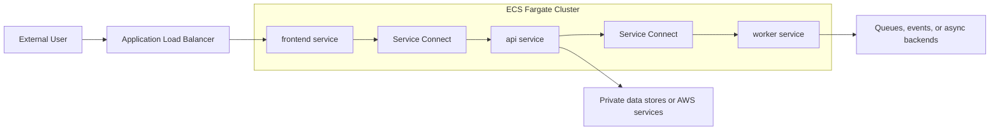
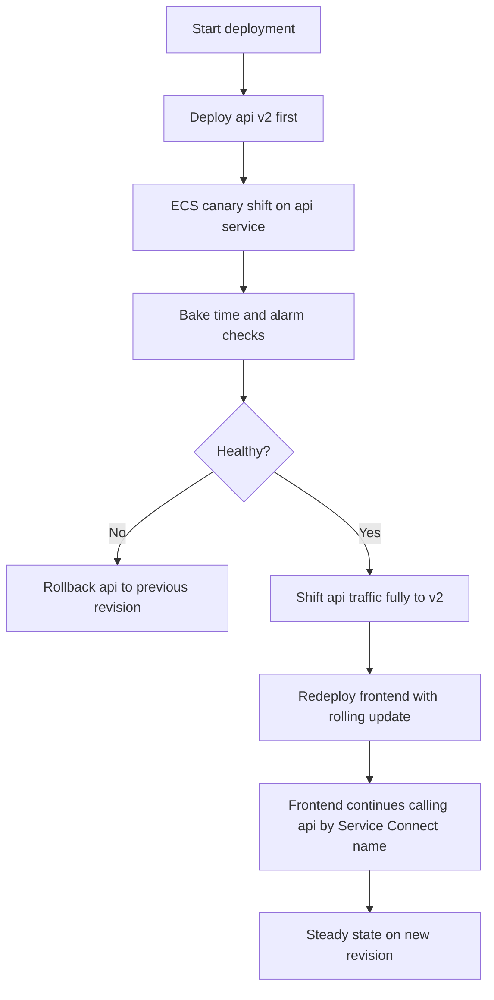

# ECS Fargate User Guide

This guide explains how to use this module for Fargate-only ECS workloads,
especially multi-tier service layouts and ECS-native deployment strategies.

## Before You Start

This module manages the ECS layer only. Plan to provide these resources
externally:

- VPC and subnet IDs
- security group IDs
- task execution role ARNs
- task role ARNs
- log groups
- target groups and listener rules
- Cloud Map namespace ARN if using Service Connect
- ECS ALB infrastructure role ARN for `BLUE_GREEN`, `LINEAR`, or `CANARY`

Version floor:

- Terraform `>= 1.5.7`
- AWS provider `>= 6.34.0`

## Core Shape

Every service lives under `container_config`:

```hcl
module "ecs" {
  source = "./terraform-aws-ecs-fargate"

  cluster_name = "my-app"
  vpc_id       = var.vpc_id

  container_config = {
    frontend = {
      container_name = "frontend"

      task_definition = {
        cpu                 = 512
        memory              = 1024
        image               = var.frontend_image
        execution_role_arn  = var.frontend_execution_role_arn
        task_role_arn       = var.frontend_task_role_arn
        task_log_group_name = "/ecs/my-app/frontend"

        port_mappings = [
          {
            name          = "http"
            containerPort = 80
            hostPort      = 80
            protocol      = "tcp"
            appProtocol   = "http"
          }
        ]
      }

      service = {
        desired_count    = 2
        security_groups  = [var.frontend_security_group_id]
        subnets          = var.private_subnet_ids
      }
    }
  }
}
```

Each entry becomes:

- one task definition
- one ECS service
- optional autoscaling resources
- optional deployment alarms

## Multi-Tier Usage Patterns

## Pattern 1: Public Frontend, Private API, Background Worker

This is the default shape for a Fargate multi-tier application:

- `frontend`: public or edge-facing, attached to a target group
- `api`: private service, reachable through Service Connect or an internal LB
- `worker`: no inbound traffic, asynchronous processing

Recommended defaults:

- `frontend`: `ROLLING`, on-demand `FARGATE`
- `api`: `CANARY` or `LINEAR` if you want safer traffic shifting
- `worker`: `ROLLING`, weighted toward `FARGATE_SPOT`

Real-world usage:

- SaaS products with a public web app, a private application API, and async job
  workers
- e-commerce platforms with storefront, order or catalog API, and background
  processing for inventory, fulfillment, or payment events
- internal enterprise portals with a browser-facing UI, private backend
  services, and scheduled or event-driven workers

## Pattern 2: External Ingress Through ALB, Internal Hops Through Service Connect

This is the combined pattern most teams want:

- internet user -> ALB -> `frontend`
- `frontend` -> `api` over Service Connect
- `api` -> `worker` or other private services over Service Connect

This is also the closest fit to the ECS Immersion Day style architecture: keep
public ingress at the edge, and keep east-west service traffic inside the ECS
namespace.

A practical split is:

- `frontend`: externally reachable through a target group
- `frontend`: Service Connect client only
- `api`: Service Connect client-server service
- `worker`: Service Connect client only, or no Service Connect if it does not
  call internal services

Diagram:



Example:

```hcl
service_connect_configuration = {
  enabled   = true
  namespace = var.service_connect_namespace_arn
}

container_config = {
  frontend = {
    container_name = "frontend"

    task_definition = {
      image               = var.frontend_image
      execution_role_arn  = var.frontend_execution_role_arn
      task_role_arn       = var.frontend_task_role_arn
      task_log_group_name = "/ecs/my-app/frontend"

      port_mappings = [
        {
          name          = "http"
          containerPort = 80
          hostPort      = 80
          protocol      = "tcp"
          appProtocol   = "http"
        }
      ]
    }

    service = {
      security_groups = [var.frontend_security_group_id]
      subnets         = var.private_subnet_ids

      target_groups = [
        {
          target_group_arn = var.frontend_target_group_arn
          container_name   = "frontend"
          container_port   = 80
        }
      ]

      # Client-only Service Connect. The frontend can call "api"
      # by short name inside the namespace.
      service_connect = {
        enabled   = true
        namespace = var.service_connect_namespace_arn
        services  = []
      }
    }
  }

  api = {
    container_name = "api"

    task_definition = {
      image               = var.api_image
      execution_role_arn  = var.api_execution_role_arn
      task_role_arn       = var.api_task_role_arn
      task_log_group_name = "/ecs/my-app/api"

      port_mappings = [
        {
          name          = "api-http"
          containerPort = 8080
          hostPort      = 8080
          protocol      = "tcp"
          appProtocol   = "http"
        }
      ]
    }

    service = {
      security_groups = [var.api_security_group_id]
      subnets         = var.private_subnet_ids

      service_connect = {
        enabled   = true
        namespace = var.service_connect_namespace_arn

        services = [
          {
            port_name      = "api-http"
            discovery_name = "api"
            client_aliases = [
              {
                dns_name = "api"
                port     = 8080
              }
            ]
          }
        ]
      }
    }
  }
}
```

Why this pattern works well:

- public traffic is isolated to the edge tier
- internal DNS names stay stable even when tasks roll
- internal tiers do not need their own internal ALB
- retries and proxy-side balancing are handled by Service Connect

Real-world usage:

- customer-facing web applications where users hit an ALB but frontend-to-API
  traffic should stay private
- backend-for-frontend architectures where the UI tier calls private services by
  stable internal names
- modernization programs moving from VM-based app tiers to private service
  networking without introducing a full service mesh

Security group rules usually look like this:

- ALB security group -> `frontend` on the frontend listener port
- `frontend` security group -> `api` on the API `containerPort`
- `api` security group -> `worker` on the worker `containerPort`, if needed

If you use `ingress_port_override`, allow that port instead of the raw
`containerPort`.

Rollout order matters:

- add Service Connect to the backend service first
- redeploy the frontend client service after the backend endpoint exists

AWS notes that existing tasks do not see new Service Connect endpoints until
they are redeployed, so backend-first rollout avoids a frontend that is public
before its private dependency is ready.

One more nuance: AWS documents that when a load-balanced service also uses
Service Connect in `awsvpc` mode, ALB traffic defaults to routing through the
Service Connect agent. If you want non-service traffic to bypass the agent, use
`ingress_port_override` on that service.

Deployment flow example:

This is a safe rollout order for the combined pattern when:

- `frontend` uses `ROLLING`
- `api` uses `CANARY`
- `frontend` calls `api` by Service Connect name



Notes:

- the API canary path assumes the API service has advanced target group wiring
  for ECS-native traffic shifting
- backend-first rollout is safer when Service Connect endpoint configuration is
  changing
- frontend rolling comes after API health is established, so public users are
  less likely to hit a frontend that depends on an unready backend

## Pattern 3: Service Connect For Internal Tiers

Use Service Connect when internal tiers should call each other by stable
service names.

Important rule:

- `service.service_connect.services[].port_name` must match the `name` on one
  of the container `port_mappings`

Example:

```hcl
task_definition = {
  image               = var.api_image
  execution_role_arn  = var.api_execution_role_arn
  task_role_arn       = var.api_task_role_arn
  task_log_group_name = "/ecs/my-app/api"

  port_mappings = [
    {
      name          = "api-http"
      containerPort = 8080
      hostPort      = 8080
      protocol      = "tcp"
      appProtocol   = "http"
    }
  ]
}

service = {
  security_groups = [var.api_security_group_id]
  subnets         = var.private_subnet_ids

  service_connect = {
    enabled   = true
    namespace = var.service_connect_namespace_arn

    services = [
      {
        port_name      = "api-http"
        discovery_name = "api"
        client_aliases = [
          {
            dns_name = "api"
            port     = 8080
          }
        ]
      }
    ]
  }
}
```

Use this when:

- the frontend calls the API by service name
- the API calls other internal services
- you want ECS-managed service discovery without a dedicated internal ALB

Real-world usage:

- internal microservice platforms where services discover each other by name
- multi-service APIs that need private HTTP or RPC communication between tiers
- platform teams that want lighter-weight service discovery than operating
  internal load balancers for every service

## Pattern 4: Mixed FARGATE And FARGATE_SPOT

Cluster-level defaults can stay conservative while individual services override
their own strategy.

Common split:

- `frontend`: `FARGATE` only
- `api`: `FARGATE` only
- `worker`: mostly `FARGATE_SPOT`, small `FARGATE` base

Example:

```hcl
service = {
  capacity_provider_strategy = [
    {
      capacity_provider = "FARGATE_SPOT"
      weight            = 4
      base              = 1
    },
    {
      capacity_provider = "FARGATE"
      weight            = 1
      base              = 0
    }
  ]
}
```

Use interruption-tolerant tiers only. Do not push edge-facing tiers to Spot
unless brief capacity loss is acceptable.

Real-world usage:

- queue consumers, schedulers, and batch workers that can tolerate replacement
  or retry
- nightly processing, report generation, indexing, media conversion, and other
  non-edge workloads
- cost-optimized internal jobs where partial Spot usage is worth the
  interruption tradeoff

## Pattern 5: Edge Load Balanced, Internal Services Unexposed

A clean service boundary is:

- target groups only for edge-facing services
- Service Connect for internal RPC or HTTP calls
- workers with no target groups and no inbound port mappings

This reduces ALB sprawl and keeps internal dependencies explicit.

Real-world usage:

- SaaS web apps where only the browser-facing frontend should be public
- B2B platforms with a customer dashboard, private API tier, and private worker
  tier
- content, workflow, and event-driven systems where internal services should
  never be direct network entry points
- teams that want clearer security boundaries and fewer internal load balancers

See [`examples/complet-parten5`](./examples/complet-parten5) for a concrete
three-tier implementation of this pattern.

## Deployment Strategies

## Strategy Selection

The module supports:

- `ROLLING`
- `BLUE_GREEN`
- `LINEAR`
- `CANARY`

Use them in two places:

- module default: `deployment_strategy_default`
- per-service override: `service.deployment_configuration.strategy`

## Rolling

Use `ROLLING` when:

- the service is simple
- you only need standard ECS deployments
- you are not doing traffic splitting between target groups

Example module defaults:

```hcl
deployment_strategy_default = "ROLLING"

deployment_configuration = {
  deployment_circuit_breaker = {
    enable   = true
    rollback = true
  }
  maximum_percent         = 200
  minimum_healthy_percent = 100
}
```

## Canary

Use `CANARY` when:

- you want a small first traffic shift
- you want CloudWatch alarms to stop or roll back bad deploys
- you have a public or internal HTTP tier behind an ALB listener rule

Required inputs:

- `target_groups[].target_group_arn`
- `target_groups[].alternate_target_group_arn`
- `target_groups[].production_listener_rule`
- `service.deployment_configuration.ecs_alb_service_role_arn`

Example:

```hcl
service = {
  deployment_configuration = {
    strategy                 = "CANARY"
    bake_time_in_minutes     = 10
    ecs_alb_service_role_arn = var.api_ecs_alb_service_role_arn

    canary_configuration = {
      canary_percent              = 10
      canary_bake_time_in_minutes = 10
    }

    alarms = {
      enable      = true
      rollback    = true
      alarm_names = var.api_deployment_alarm_names
    }
  }

  target_groups = [
    {
      target_group_arn           = var.api_blue_target_group_arn
      alternate_target_group_arn = var.api_green_target_group_arn
      production_listener_rule   = var.api_production_listener_rule_arn
      container_name             = "api"
      container_port             = 8080
    }
  ]
}
```

## Linear

Use `LINEAR` when:

- you want a gradual, repeating traffic shift
- the deploy risk is real, but canary is too coarse

Example:

```hcl
service = {
  deployment_configuration = {
    strategy                 = "LINEAR"
    bake_time_in_minutes     = 10
    ecs_alb_service_role_arn = var.api_ecs_alb_service_role_arn

    linear_configuration = {
      step_percent              = 25
      step_bake_time_in_minutes = 5
    }
  }
}
```

## Blue/Green

Use `BLUE_GREEN` when:

- you want the full replacement environment ready before cutover
- you need the cleanest rollback path for a load-balanced tier

The same advanced load balancer requirements apply as for `CANARY` and
`LINEAR`.

## Lifecycle Hooks

For non-rolling ECS-native deployments, you can attach Lambda-backed lifecycle
hooks:

```hcl
service = {
  deployment_configuration = {
    strategy = "CANARY"

    lifecycle_hooks = [
      {
        hook_target_arn  = var.validation_lambda_arn
        role_arn         = var.validation_hook_role_arn
        lifecycle_stages = ["PRE_SCALE_UP", "TEST_TRAFFIC_SHIFT"]
      }
    ]
  }
}
```

Use this when you want validation logic at deployment checkpoints.

## Task Definition Guidance

Prefer the synthesized task definition path for normal services:

- `task_definition.environment`
- `task_definition.port_mappings`
- `task_definition.mount_points`
- `task_definition.firelens_configuration`
- `task_definition.ephemeral_storage`
- `task_definition.operating_system_family`
- `task_definition.cpu_architecture`

Use `task_definition.container_definition` only when you need a fully prebuilt
JSON container definition that the synthesized input shape does not cover.

## Cluster-Level Features

## Managed Storage Configuration

The cluster supports optional managed storage configuration for Fargate
ephemeral storage encryption:

```hcl
cluster_configuration = [
  {
    execute_command_configuration = {
      logging = "OVERRIDE"
      log_configuration = {
        cloud_watch_log_group_name = var.exec_log_group_name
      }
    }

    managed_storage_configuration = {
      fargate_ephemeral_storage_kms_key_id = var.fargate_ephemeral_storage_kms_key_id
      kms_key_id                           = var.managed_storage_kms_key_id
    }
  }
]
```

Use this if your platform requires customer-managed keys for Fargate storage.

## Service Connect TLS

The module exposes the nested ECS Service Connect TLS block.

Example:

```hcl
service_connect = {
  enabled   = true
  namespace = var.service_connect_namespace_arn

  services = [
    {
      port_name = "api-http"
      tls = {
        issuer_cert_authority = {
          aws_pca_authority_arn = var.aws_pca_authority_arn
        }
        kms_key  = var.service_connect_tls_kms_key_arn
        role_arn = var.service_connect_tls_role_arn
      }
    }
  ]
}
```

## Example Selection

Use [`examples/simple`](./examples/simple) when you need:

- one service
- one target group
- minimal wiring

Use [`examples/complete`](./examples/complete) when you need:

- a real multi-tier layout
- Service Connect
- mixed capacity providers
- ECS-native canary deployment
- autoscaling examples

Use [`examples/complet-parten5`](./examples/complet-parten5) when you need:

- one edge-facing service behind a target group
- internal API calls over Service Connect
- a private worker tier with no inbound port mappings

## Practical Defaults

If you are starting from scratch, this is the safest baseline:

- `frontend`: `ROLLING`, target group attached, `FARGATE`
- `api`: `ROLLING` first, then move to `CANARY` once alarms and listener rules
  exist
- `worker`: `ROLLING`, no target group, `FARGATE_SPOT` weighted if interruption
  is acceptable

Start simple, then add traffic shifting once the surrounding ALB and rollback
signals are reliable.
