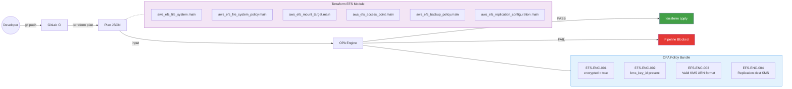
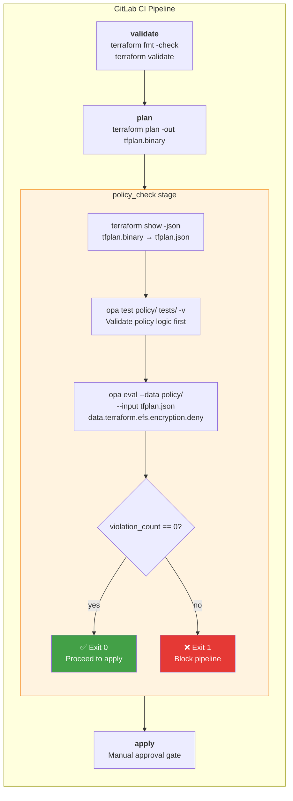
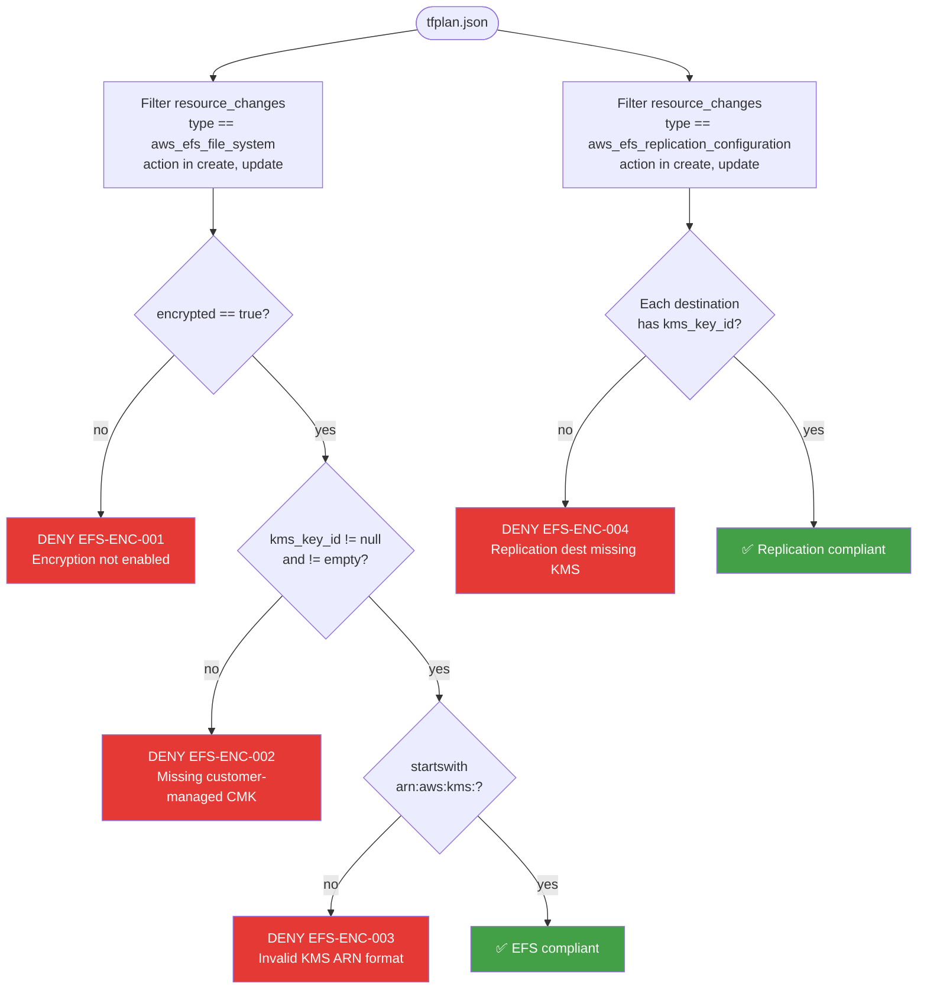

# OPA Policy: EFS KMS Encryption at Rest

## 1. Assumptions & Inputs

| Item | Assumption |
|---|---|
| Terraform version | >= 1.0 |
| OPA version | >= 0.60 (uses `import rego.v1` syntax) |
| Plan format | Terraform JSON plan via `terraform show -json` |
| KMS key | Pre-provisioned customer-managed CMK; ARN passed via `var.kms_key_arn` |
| CI/CD | GitLab CI/CD (pipeline snippet included) |
| Scope | `aws_efs_file_system` create/update + `aws_efs_replication_configuration` destinations |
| Terraform module | [terraform-aws-efs](https://github.com/PrasanthDevops339/AWS-Terraform-Playground/blob/feature/ami-management-policy/Terrafrom-AWS-Prasanth/terraform-aws-efs/main.tf) with `encrypted = true` and `kms_key_id = var.kms_key_arn` |

**Why customer-managed KMS instead of AWS-managed?** The AWS default key (`aws/elasticfilesystem`) works but doesn't support cross-account access, custom key rotation schedules, key policy customization, or CloudTrail visibility into key usage. Customer-managed CMKs give your security team full lifecycle control — critical for regulated environments.

---

## 2. Recommended Architecture (HLD)

The policy operates as a **pre-apply gate** in the GitLab CI/CD pipeline, evaluating Terraform plan JSON against OPA rules before any infrastructure changes are applied.



---

## 3. Detailed Design (LLD)

### 3.1 Pipeline Flow — Policy Check Stage



### 3.2 OPA Rule Evaluation Logic



### 3.3 Policy-to-Terraform Mapping

| OPA Rule | Code | Terraform Attribute | Expected Value |
|---|---|---|---|
| Encryption enabled | EFS-ENC-001 | `aws_efs_file_system.encrypted` | `true` |
| Customer-managed KMS | EFS-ENC-002 | `aws_efs_file_system.kms_key_id` | Non-null, non-empty |
| Valid KMS ARN | EFS-ENC-003 | `aws_efs_file_system.kms_key_id` | Starts with `arn:aws:kms:` |
| Replication KMS | EFS-ENC-004 | `aws_efs_replication_configuration.destination[*].kms_key_id` | Non-null, non-empty |

---

## 4. Implementation Plan

### 4.1 Repository Layout

```
opa-efs-kms/
├── policy/
│   └── efs_encryption.rego          # Main policy (4 rules)
├── tests/
│   └── efs_encryption_test.rego     # 20+ unit tests
├── examples/
│   ├── tfplan_compliant.json        # Passes all rules
│   └── tfplan_noncompliant.json     # Triggers EFS-ENC-001 + EFS-ENC-004
├── scripts/
│   └── evaluate.sh                  # Local evaluation wrapper
├── docs/
│   └── gitlab-ci-snippet.yml        # Drop-in CI stage
└── README.md                        # This file
```

### 4.2 Integration Steps

**Step 1:** Copy `policy/` directory into your Terraform repo (e.g., `opa/policy/`).

**Step 2:** Copy `tests/` directory alongside (e.g., `opa/tests/`).

**Step 3:** Add the `policy_check` stage from `docs/gitlab-ci-snippet.yml` into your `.gitlab-ci.yml`.

**Step 4:** Adjust the `needs:` job name to match your existing `terraform plan` job.

**Step 5:** Merge to a feature branch and verify the pipeline.

### 4.3 Local Development

```bash
# Run unit tests
opa test policy/ tests/ -v

# Evaluate against a compliant plan
opa eval --data policy/ --input examples/tfplan_compliant.json \
  --format pretty 'data.terraform.efs.encryption.deny'
# Expected: []

# Evaluate against a non-compliant plan
opa eval --data policy/ --input examples/tfplan_noncompliant.json \
  --format pretty 'data.terraform.efs.encryption.deny'
# Expected: 2 violations (EFS-ENC-001, EFS-ENC-004)

# Use the wrapper script
chmod +x scripts/evaluate.sh
./scripts/evaluate.sh examples/tfplan_compliant.json policy/
./scripts/evaluate.sh examples/tfplan_noncompliant.json policy/
```

---

## 5. Operations & Support

### 5.1 Runbook: Policy Violation Remediation

**Scenario: Pipeline blocked by EFS encryption policy**

| Step | Action |
|---|---|
| 1 | Read the `policy_check` job log to identify which rule fired (EFS-ENC-001 through 004) |
| 2 | **EFS-ENC-001:** Add `encrypted = true` to your `aws_efs_file_system` resource |
| 3 | **EFS-ENC-002:** Add `kms_key_id = var.kms_key_arn` — request a CMK from the security team if none exists for this account/region |
| 4 | **EFS-ENC-003:** Verify the KMS key ARN format is `arn:aws:kms:<region>:<account>:key/<id>` or `arn:aws:kms:<region>:<account>:alias/<alias>` |
| 5 | **EFS-ENC-004:** Add `kms_key_id` to every `destination` block in `aws_efs_replication_configuration` |
| 6 | Run `terraform plan` locally and pipe through `scripts/evaluate.sh` to verify fix |
| 7 | Push and re-run pipeline |

### 5.2 Requesting a Policy Exception

If a legitimate use case requires an exception (e.g., AWS-managed key for a non-production sandbox), the team lead should open a ticket with the CCoE/InfoSec team. The policy can be extended with an allowlist:

```rego
# Future: exception list (not included by default)
exception_addresses := {"module.sandbox_efs.aws_efs_file_system.main"}
```

---

## 6. Security & Compliance

| Control | How This Policy Enforces It |
|---|---|
| Encryption at rest | Rule EFS-ENC-001 blocks unencrypted EFS |
| Customer key management | Rule EFS-ENC-002 rejects AWS-managed default keys |
| ARN integrity | Rule EFS-ENC-003 validates KMS ARN format |
| DR encryption | Rule EFS-ENC-004 ensures replication targets are also encrypted |
| Shift-left | Violations caught at plan time before any infra is created |
| Audit trail | CI pipeline logs capture every violation with structured codes |

**Compliance mapping:** CIS AWS Foundations 2.4.1, AWS Well-Architected SEC08-BP02 (encryption at rest using customer-managed keys).

---

## 7. Validation Checklist

- [ ] `opa test policy/ tests/ -v` — all 20+ tests pass
- [ ] `evaluate.sh` returns exit 0 on `tfplan_compliant.json`
- [ ] `evaluate.sh` returns exit 1 on `tfplan_noncompliant.json`
- [ ] GitLab CI `policy_check` stage added and runs on MR pipelines
- [ ] Policy correctly evaluates module-sourced EFS resources (`module.efs.aws_efs_file_system.main`)
- [ ] Delete/no-op actions are ignored (no false positives)
- [ ] Replication destination KMS is validated
- [ ] Runbook shared with application teams
- [ ] KT/handoff session completed with recordings/notes

---

## 8. Future Enhancements

- **Expand to other storage services**: S3, RDS, DynamoDB, EBS — build a unified `encryption` policy package
- **Tag-based exception system**: Allow exceptions via resource tags (e.g., `opa-exception: EFS-ENC-002`) with auto-expiry
- **Conftest integration**: Use [Conftest](https://www.conftest.dev/) as an alternative runner for easier Terraform native integration
- **OPA bundle server**: Publish policies as bundles for centralized distribution across all team pipelines
- **ServiceNow integration**: Auto-create incidents on policy violations (similar to your Dynamo rules.json pattern)
