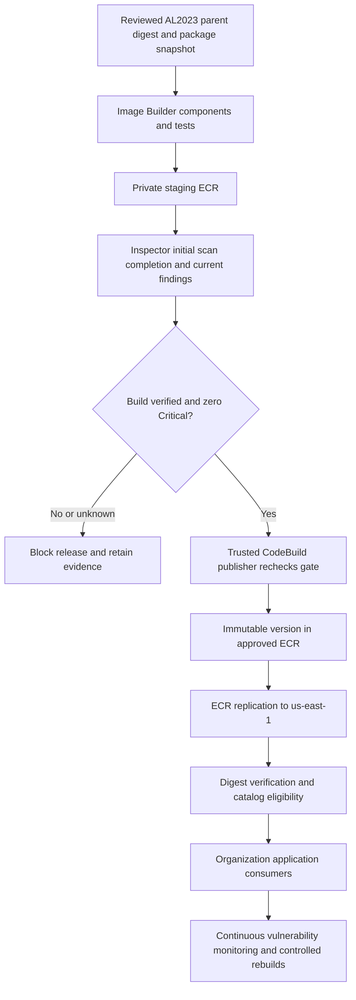

# Golden Container Image Factory — AL2023 implementation and rollout

**Repository:** `containerimages`, independent of the existing `Imagebuilder` appliance infrastructure.  
**Infrastructure:** native Terraform; no CloudFormation wrappers or build/push provisioners.  
**Initial artifact:** standard AL2023 Linux x86_64 container image.  
**Production target:** `prasanth-operations-prd`; numeric account ID is a required deployment input.  
**Regions:** build and scan in `us-east-2`; replicate accepted releases to `us-east-1`.  
**Delivery state:** source implementation and local validation; live AWS deployment and enterprise acceptance remain separate steps.

## 1. Objective and Jira interpretation

Provide centrally maintained, hardened base containers that application teams can consume across AWS Organizations. First deliver the AL2023 pipeline and release controls, then reuse the foundation for .NET runtime, approved Red Hat/UBI and third-party families.

The Jira requires the Platform Team ECR module. Inspection of `Terrafrom-AWS-Prasanth`, including hidden and ignored files, found no ECR module or ECR resources. The user explicitly authorized native Terraform resources when no module exists. This implementation follows that fallback and records it for stakeholder review; it does not claim to have integrated a missing module.

Existing DataSync and Storage Gateway AMI infrastructure remains separate. Organization AMI launch permissions do not provide ECR access. The decision to build once and replicate should be recorded against the Jira's original two-Region pipeline wording.

## 2. Architecture and trust boundaries

Terraform creates the repositories, encryption keys, Image Builder resources, roles, private build security group, evidence bucket, release ledger, event rules, Lambda workers, Step Functions workflow, CodeBuild publisher, notification topic, alarms and dashboard. Development and production have separate environment roots and backend keys.

| Identity | Allowed responsibility |
|---|---|
| Image Builder instance role | Build/test containers and push only to staging. |
| Event ingester | Verify service events and build identity, retain completion evidence, start release workflows. |
| Scan evaluator | Read build/scan evidence, enforce policy, allocate versions and update release records. |
| Publisher | Recheck the gate, read staging and push accepted content to the approved source repository. |
| Release monitor | Recheck released images, withdraw catalog eligibility, notify and request bounded remediation builds. |
| Application identities | Pull approved images using organization-scoped repository access and their workload IAM permissions. |

Application consumers cannot pull staging images. Repository policies restrict approved writes to the publisher, with a separate trusted replication identity in the destination Region. The publisher does not execute candidate containers or use privileged Docker mode. Its code and worker image are trusted deployment inputs; only the Step Functions role receives ordinary `StartBuild` permission from this repository. Organization administrators remain able to change infrastructure and policies and must be governed through existing deployment controls.

## 3. AL2023 image contents

Use `public.ecr.aws/amazonlinux/amazonlinux@sha256:...`, pinned to a reviewed standard AL2023 image. The container parent is distinct from the EC2 AMI that hosts the build. The standard image uses `dnf`; a future minimal variant needs its own recipe and compatibility checks. [AWS AL2023 container documentation](https://docs.aws.amazon.com/linux/al2023/ug/base-container.html)

The baseline component:

1. Verifies AL2023 and x86_64 identity.
2. Adds the public enterprise CA bundle and refreshes system trust.
3. Replaces package definitions with approved HTTPS repositories using package-signature verification.
4. Upgrades and installs packages from an explicit AL2023 `releasever` snapshot.
5. Creates application UID/GID `10001:10001` and `/app` as the documented writable application directory.
6. Removes package caches and setuid/setgid permissions from executable trees.
7. Records source revision, parent digest, recipe version and package snapshot inside the image.
8. Writes an RPM inventory and SPDX 2.3 OS-package SBOM under `/usr/local/share/containerimages/`.

Tests check OS/architecture, certificate availability, inventory/SBOM presence, permissions and representative Python startup under the application identity. The final Dockerfile defaults to `USER 10001:10001`; the publisher separately verifies that final configuration before copying. Application teams may need their own writable directories and startup commands. Runtime-specific dependencies and actual ECS/EKS deployment behavior require live acceptance.

This SBOM describes installed RPM packages. It does not claim to inventory every future application-language dependency; extending image families requires corresponding SBOM generation and smoke tests.

## 4. Scan gate and official publication

### Candidate versus official upload

ECR enhanced scanning runs after a candidate is uploaded to ECR. Therefore the candidate first enters a restricted staging repository. It receives an official version in the approved repository only after the gate passes. This satisfies the agreed publication boundary; it is not a claim that ECR scans a local image before any upload. [AWS enhanced scanning](https://docs.aws.amazon.com/AmazonECR/latest/userguide/image-scanning-enhanced.html)

Repository names include the factory/environment to prevent collisions: `staging/<factory>/al2023-base` and `golden/<factory>/al2023-base`.

### Acceptance policy

- Verify the Image Builder source pipeline, `AVAILABLE` state, enabled tests, target repository and exact output digest through AWS APIs.
- Require Inspector initial-scan completion evidence from a service event or an explicit API completion timestamp. Coverage status `ACTIVE` alone is insufficient.
- Confirm current enhanced scan coverage is `ACTIVE` and that the returned account, repository and digest match the candidate.
- Read all pages of unresolved Inspector findings, including `ACTIVE` and `SUPPRESSED` states.
- Block every Critical finding, including vulnerabilities with no fix. Lower severities are reported without blocking in v1.
- Treat a legitimately omitted Critical count as zero only inside valid scan evidence. Missing entire scan data or summaries do not pass.
- Use the more restrictive verdict when scan summaries, initial events and current findings temporarily disagree. Stale Critical evidence can conservatively keep an unchanged digest blocked.
- Block unsupported, expired, failed and malformed scan states. Poll pending evidence with a default 60-minute wall-clock deadline. There is no bypass or fallback scanner.

Inspector completion and build events can arrive in either order; the ledger retains scan evidence independently. Duplicate events are idempotent, and older completion events cannot replace newer records. [Inspector event schema](https://docs.aws.amazon.com/inspector/latest/user/eventbridge-integration.html)

### Versions and promotion

Official release versions begin at `1.0.0`. The reviewed major/minor series is a Terraform input; DynamoDB atomically allocates patch numbers. A digest retains its assigned version on retry. Concurrent allocation can leave gaps, which are never reused. Image Builder recipe versions are independent and must change whenever immutable recipe/component content changes.

The trusted publisher refreshes the scan verdict at the copy boundary and uses Skopeo with digest preservation. It does not rebuild the image. Existing matching version/digest pairs are idempotent; conflicting versions fail. ECR tags are immutable. Final version metadata stays in the release ledger/evidence instead of changing the scanned artifact.

Replication is asynchronous. Only the factory's approved prefix is replicated; staging is excluded. Destination repositories are created first with their own regional encryption and pull policies. The catalog becomes eligible only after the version resolves to the expected digest in both Regions. Source-region publication may be visible while replication is pending; cross-region publication is not atomic.

## 5. Runtime security: CrowdStrike and Tripwire

Image vulnerability scanning, build-host protection and workload runtime protection are separate controls. ECR/Inspector does not replace CrowdStrike or Tripwire requirements.

| Runtime | CrowdStrike approach to validate with InfoSec |
|---|---|
| ECS on customer-managed EC2 | Supported enterprise host sensor with verified container visibility. |
| EKS on EC2 | Supported node sensor/operator deployment; avoid duplicate host sensors. |
| ECS Fargate | Vendor-supported initialization and application entrypoint instrumentation, including required permissions and volumes. |
| EKS Fargate | Supported container injection/instrumentation for the selected platform and sensor versions. |

Do not install EC2 host-agent packages in every generic application image. Fargate integrations are not equivalent to adding an unrelated sidecar. Validate startup dependency failure, non-root compatibility, writable mounts, shutdown behavior, telemetry and vendor support. Keep sensor lifecycle independent of the base-image patch lifecycle.

Tripwire's exact product, supported operating systems, licensing and container deployment model remain enterprise decisions. A sidecar cannot automatically see another container's entire filesystem. Host monitoring, shared-volume inspection, read-only root filesystems and image integrity controls must be evaluated against the actual requirement; none is silently declared a substitute.

Vendor credentials must be retrieved at runtime through approved secret management. Private keys, enrollment credentials and API tokens must not enter Docker layers, Terraform state, component parameters or logs. The first AL2023 implementation includes these integration requirements in documentation; it does not claim deployed vendor telemetry.

## 6. Shared configuration and deployment inputs

Registry scanning and replication are account/Region-wide settings. `manage_registry_configuration` defaults to `false` so the repository does not overwrite another team's configuration. The registry owner must either supply the required settings externally or explicitly adopt them into this state with all existing rules preserved. Scan coverage remains a runtime prerequisite regardless of Terraform ownership.

Required inputs before deployment:

- Numeric AWS account ID and organization ID.
- Separate development/production backend settings, deployment identities and an approved S3 server-access-log destination.
- Approved private VPC/subnet and HTTPS egress destinations, with functioning DNS and AWS service connectivity.
- Supported build-host AMI with Docker, SSM and enterprise host security, plus compatible root-volume mapping.
- Reviewed AL2023 parent digest, package release, package sources and public CA bundle.
- Reviewed source revision, recipe version and release series.
- Trusted promotion-worker ECR digest built from the included worker Dockerfile.
- Confirmed enhanced-scanning coverage, replication ownership and notification-system subscription.

No real account IDs, certificates, digests or deployment credentials are invented. Examples deliberately require replacement. The supplied trusted-worker Dockerfile is a bootstrap artifact, built and scanned separately by the platform before its digest is provided to this factory.

## 7. Operations, rollback and costs

The release monitor checks approved images periodically and responds to Critical finding events. It withdraws catalog eligibility on Critical findings or unusable scan coverage and notifies the platform. Automatic vulnerability remediation is limited to one attempt per day and three attempts per reviewed source revision. New upstream digests/package snapshots require a reviewed configuration change; rebuilding the same pinned inputs cannot guarantee a fix.

Withdrawing eligibility does not delete the image, deny ECR pulls or stop running workloads. Application delivery systems must check the catalog and adopt replacements. Existing workloads require coordinated remediation.

Encrypted evidence records include build/digest identity, scan verdicts, version allocation, publication, regional verification and failures. CloudWatch alarms cover blocked/withdrawn releases, scan/replication deadlines, workflow failure, missing build heartbeat, worker errors and dead-letter queues. Connect the created SNS topic to the enterprise notification system and verify delivery before production.

Keep scheduled builds disabled until the first development acceptance run. When enabled, builds run weekly. Temporary build instances terminate on failure; CodeBuild concurrency, build timeouts, candidate retention, log retention and remediation budgets bound avoidable costs. Inspector scanning, regional image storage/transfer, build compute, encryption keys and monitoring remain ongoing cost drivers; see the cost worksheet guidance in this repository.

Rollback consumers to a previously accepted digest and restore the reviewed prior automation/configuration version. Preserve immutable image tags, evidence, encryption keys and release counters. Do not reuse a version, rebuild an old version tag, restore Terraform state alone or destroy repositories as a rollback mechanism.

## 8. Validation and acceptance

Local validation uses Terraform formatting/validation, mocked Terraform tests, Python unit tests with AWS API stubs, Trivy and Checkov. These checks address compliance gaps, secret exposure, permission scope, CI drift, provider compatibility and testing blind spots. They do not demonstrate live cross-account IAM, private-network connectivity, real Inspector latency, vendor support or successful container execution in your clusters.

Development acceptance must prove a clean AL2023 build, a blocked Critical candidate, failure on missing/expired scan evidence, version idempotency, denied staging consumption, denied unauthorized approved writes, exact digest replication, alert delivery and representative ECS/EKS startup. Keep a controlled vulnerable test artifact isolated and remove it under the test-retention policy.

Production rollout requires a reviewed Terraform plan and completed stakeholder acceptance. Cloud Platform owns factory operation; InfoSec owns policy/vendor acceptance; certificate/package owners approve sources; application teams own adoption. Publish reviewed standards to the CITP Confluence area through the established documentation process.

## 9. Later image families

Add ARM64 only after package, worker and runtime-security compatibility testing. Treat AL2023 minimal as a separate variant. Add .NET runtime/ASP.NET and SDK images separately with support and native-dependency checks. Confirm Red Hat/UBI entitlement and redistribution requirements. For third-party images, establish provenance, modification rights, vendor support and update ownership before onboarding.
