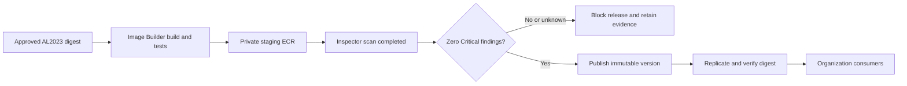

# AL2023 container factory — implementation plan

## Summary

Update `Imagebuilder/GOLDEN_CONTAINER_IMAGE_FACTORY_PLAN.md` and create a separate repository at `/Users/prasanthkorepally/Documents/GitHub/containerimages`.

No ECR module was found in `Terrafrom-AWS-Prasanth`. Use **native Terraform resources**, as authorized, and record this replacement for the Jira’s Platform ECR module requirement.

The first implementation delivers **AL2023 x86_64 containers**, built through AWS EC2 Image Builder, scanned with **ECR enhanced scanning / Amazon Inspector**, and published only when no Critical vulnerabilities remain.

**Current status:** implementation is ready to proceed when Plan mode ends. No files or AWS resources have changed.

## Repository and infrastructure

- Rewrite the existing Markdown around the independent repository, native Terraform, AL2023 implementation, scan gate, organization sharing, operational procedures and remaining deployment inputs. Preserve .NET, Red Hat/UBI and third-party families as later phases.
- Create independent environment configurations, reusable Terraform modules, Image Builder components, release automation, tests and documentation in `containerimages`.
- Provision ECR, Image Builder, IAM, encrypted storage, EventBridge, Step Functions, Lambda scan evaluators, a CodeBuild promotion worker, DynamoDB release records and CloudWatch monitoring through Terraform.
- Terraform manages infrastructure and workflow configuration; version-controlled components and worker code execute builds and promotion. Avoid provisioners that build or publish images during `terraform apply`.
- Use Terraform **1.15.8** and initially pin `hashicorp/aws` **6.51.0**, with committed dependency locks. Use separate development and production S3 state with encryption, versioning and native locking.
- Treat ECR scanning and replication as shared registry configuration. Inspect and preserve existing settings before importing or extending them; do not introduce competing owners.

## AL2023 build and publication



**Build**

- Start with the standard AWS AL2023 container image, pinned by digest. Keep the container parent separate from the EC2 build-host AMI.
- Apply approved package sources and updates, enterprise CA certificates, container-specific permissions, package-cache cleanup and a documented non-root execution convention.
- Record the upstream digest, source revision, component versions, package inventory and SBOM. Keep final release-version metadata in the release record so assigning a version does not change the scanned image.
- Test AL2023 identity, architecture, certificate trust, package configuration, permissions and representative downstream application startup.
- Use private build subnets, approved outbound connectivity, IMDSv2, encrypted volumes and scoped roles.

**Scan and block**

- Build and scan in `us-east-2`. Upload candidates only to `staging/al2023-base`; consumers cannot pull from staging.
- Configure enhanced scanning for staging and approved repositories. This scans supported OS and language packages after upload; the separate promotion workflow provides the blocking behavior. [AWS enhanced scanning documentation](https://docs.aws.amazon.com/AmazonECR/latest/userguide/image-scanning-enhanced.html)
- Correlate successful Image Builder tests and Inspector initial-scan completion using the account, Region, repository and exact image digest.
- Require explicit scan-completion evidence. An `ACTIVE` coverage state or an empty findings response alone is insufficient. [Inspector event schemas](https://docs.aws.amazon.com/inspector/latest/user/eventbridge-integration.html)
- Block unresolved Critical findings, including those without fixes and suppressed findings. Report lower severities without blocking in v1.
- Block missing, unsupported, expired or failed scans. Retry transient failures with bounded backoff; default scan timeout is 60 minutes. Provide no bypass or automatic scanner fallback.

**Publish and distribute**

- Recheck findings immediately before promotion. Copy the accepted digest using a trusted CodeBuild worker with digest preservation; do not rebuild it.
- Publish to `golden/al2023-base` using immutable versions starting at `1.0.0`, with automatic patch increments.
- Use DynamoDB conditional writes for idempotency and version allocation. Retries retain the assigned version; concurrent releases receive distinct versions.
- Separate builder, evaluator and publisher permissions. Restrict promotion-worker invocation and overrides so callers cannot bypass the gate.
- Replicate only approved repositories to `us-east-1`. Verify the destination digest before marking the release available in both Regions.
- Grant organization-scoped pull access to approved repositories. Document the consumer IAM permissions required for ECS and EKS.

## Security operations and interfaces

- Keep CrowdStrike and Tripwire deployment decisions in the documentation. Do not bake EC2 agents into the generic AL2023 container.
- Use supported host or workload integrations according to ECS/EKS and EC2/Fargate deployment type. Vendor-specific integration remains subject to product support and InfoSec acceptance.
- Continuously monitor approved images. Newly discovered Critical findings withdraw catalog eligibility, notify owners and trigger a controlled rebuild process. Catalog withdrawal does not itself stop running containers or prevent existing ECR pulls.
- Record structured build, scan, promotion and replication evidence. Alarm on scan timeouts, workflow failures, dead-letter messages, replication delays and missing successful-build heartbeats.
- Require deployment inputs for account/organization identifiers, private networking, build-host AMI, approved upstream digest, certificates/package sources, backend settings and notification destinations. Do not invent production identifiers or store secret values in Terraform state.
- Expose pipeline ARN, regional repository URLs, release-workflow ARN and evidence location as Terraform outputs.

## Validation and rollout

Run from the new repository:

```bash
terraform fmt -check -recursive
terraform -chdir=environments/dev init -backend=false
terraform -chdir=environments/dev validate
terraform -chdir=environments/dev test
python3 -m unittest discover -s tests -v
trivy config .
checkov -d .
```

After development deployment inputs and backend access are available:

```bash
terraform -chdir=environments/dev init -reconfigure \
  -lockfile=readonly -backend-config=backend.hcl
terraform -chdir=environments/dev plan \
  -var-file=terraform.tfvars -out=factory.tfplan
```

Acceptance tests must demonstrate:

- Clean AL2023 candidates publish; Critical findings and incomplete scans do not.
- Duplicate and out-of-order events, paginated findings, retries and concurrent releases behave correctly.
- Builder and consumer identities cannot publish approved images.
- Published and replicated digests match the scanned candidate.
- Representative applications can pull and run the approved image.

These checks address compliance gaps, secret exposure, permission scope, CI drift and testing blind spots. Local tests cannot establish live Inspector coverage or effective cross-account permissions; verify those in development before production.

Apply production changes only from a reviewed plan. Roll back application consumers to a previous accepted digest and restore the prior automation configuration while retaining release evidence, repositories, keys and version records.
