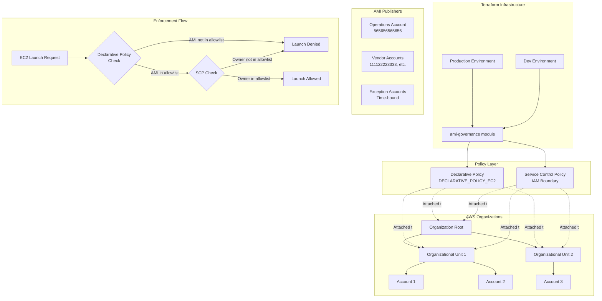
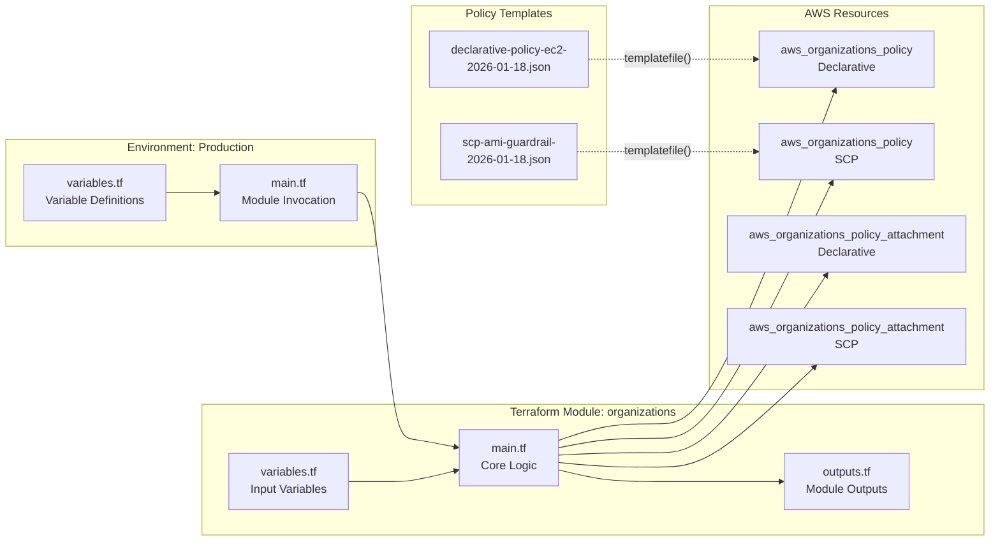

# Design Document: AMI Governance Controls

## Overview

The AMI Governance Controls system enforces centralized control over which Amazon Machine Images (AMIs) can be used to launch EC2 instances across an AWS Organization. The solution implements a defense-in-depth approach using AWS Organizations Declarative Policies as the primary enforcement mechanism and Service Control Policies (SCPs) as a secondary layer.

The system is built using Terraform Infrastructure as Code (IaC) with a modular architecture that supports multiple environments (dev, production) and provides time-bound exception management with automatic expiry validation.

**IMPORTANT - Repository Structure**: This implementation follows the structure and patterns established in the `aws-service-control-policies` repository. The `AWS-AMI-Management` repository should be ignored. All work will be done in the `aws-service-control-policies` repository following its existing conventions for:
- Environment folder organization (`environments/dev/`, `environments/prd/`)
- Module structure (`modules/organizations/`)
- JSON policy file management (`policies/` directory with date-stamped files)
- Template-based policy generation using `templatefile()` function


### Key Design Principles

1. **Defense in Depth**: Dual-layer enforcement (Declarative Policy + SCP) ensures no single point of failure
2. **Service-Level Enforcement**: Declarative policies enforce at the EC2 service control plane, preventing account-level overrides
3. **Time-Bound Exceptions**: All exceptions have mandatory expiry dates with automated validation
4. **Phased Rollout**: Support for audit mode testing before full enforcement
5. **Infrastructure as Code**: Complete Terraform implementation for version control and repeatability
6. **Modular Design**: Reusable module supporting multiple environments with different configurations
7. **Template-Based Policies**: JSON policy files use Terraform templatefile() for dynamic content generation

### Architecture Goals

- Prevent unauthorized AMI usage across all AWS accounts in the organization
- Support legitimate vendor AMIs and time-bound exceptions
- Provide clear error messages to developers when launches are blocked
- Enable phased rollout with audit mode for impact assessment
- Maintain audit trail through CloudTrail logging
- Ensure deterministic policy updates through sorted allowlists

## Architecture

### High-Level Architecture



### Enforcement Layers

#### Layer 1: Declarative Policy (Primary)

The declarative policy operates at the EC2 service control plane level, enforcing AMI restrictions before IAM evaluation. This is the primary enforcement mechanism.

**Characteristics:**
- Enforced by AWS EC2 service itself
- Cannot be overridden by account administrators
- Supports audit mode for testing
- Provides custom error messages
- Controls AMI discovery and usage

**Policy Structure (AWS Standard):**

According to AWS documentation, the correct structure for EC2 declarative policies uses `ec2_attributes` as the top-level key:

```json
{
  "ec2_attributes": {
    "@@operators_allowed_for_child_policies": ["@@none"],
    "image_block_public_access": {
      "@@operators_allowed_for_child_policies": ["@@none"],
      "state": "block_new_sharing"
    },
    "allowed_images_settings": {
      "@@operators_allowed_for_child_policies": ["@@none"],
      "state": "audit_mode" | "enabled",
      "image_criteria": {
        "criteria_1": {
          "allowed_image_providers": ["account-id-1", "account-id-2", ...],
          "creation_date_condition": {
            "maximum_days_since_created": 300
          },
          "deprecation_time_condition": {
            "maximum_days_since_deprecated": 0
          }
        }
      },
      "exception_message": "Custom error message..."
    }
  }
}
```

**AMI Age and Deprecation Controls:**
- `creation_date_condition.maximum_days_since_created`: Maximum age of AMI in days (e.g., 300 = AMI must be less than 300 days old)
- `deprecation_time_condition.maximum_days_since_deprecated`: Maximum days since deprecation (0 = no deprecated AMIs allowed)

These conditions ensure AMIs are fresh and not deprecated, enforcing patch currency.

**Note**: Some implementations may wrap this in an `ec2` top-level key, but the AWS-documented standard is to use `ec2_attributes` directly at the top level. The implementation should be updated to follow the AWS standard.

#### Layer 2: Service Control Policy (Secondary)

The SCP acts as an IAM permission boundary, providing a second layer of defense if the declarative policy is bypassed or fails.

**Characteristics:**
- IAM-based authorization control
- Always enforced (no audit mode)
- Blocks multiple EC2 launch methods
- Prevents AMI creation and side-loading
- Blocks public AMI sharing

**Policy Structure:**
```json
{
  "Version": "2012-10-17",
  "Statement": [
    {
      "Effect": "Deny",
      "Action": ["ec2:RunInstances", "ec2:CreateFleet", ...],
      "Resource": "arn:aws:ec2:*::image/*",
      "Condition": {
        "StringNotEquals": {
          "ec2:Owner": ["account-id-1", "account-id-2", ...]
        }
      }
    }
  ]
}
```

### Enforcement Modes

The system supports two operational modes for the declarative policy:

1. **Audit Mode** (`audit_mode`)
   - Logs violations without blocking
   - Adds `imageAllowed` indicators to API responses
   - Used for initial rollout and impact assessment
   - SCP still enforces (provides safety net)

2. **Enforcement Mode** (`enabled`)
   - Actively blocks non-compliant launches
   - Shows custom error messages
   - Used after audit phase validates compliance
   - Both layers actively enforce

### Policy Attachment Strategy

Policies can be attached at three levels:

1. **Organization Root**: Applies to all accounts in the organization
2. **Organizational Unit (OU)**: Applies to all accounts in the OU and child OUs
3. **Account**: Applies to a specific account only

The system supports multiple attachment points simultaneously, enabling phased rollout:
- Phase 1: Attach to pilot OU
- Phase 2: Attach to additional OUs
- Phase 3: Attach to organization root

## Components and Interfaces

### Repository Structure

The implementation follows the `aws-service-control-policies` repository structure:

```
aws-service-control-policies/
├── environments/
│   ├── dev/
│   │   ├── main.tf              # Module invocations for dev environment
│   │   ├── variables.tf         # Variable definitions
│   │   └── versions.tf          # Provider version constraints
│   └── prd/
│       ├── main.tf              # Module invocations for prd environment
│       ├── variables.tf         # Variable definitions
│       └── versions.tf          # Provider version constraints
├── modules/
│   └── organizations/
│       ├── main.tf              # Core module logic
│       ├── variables.tf         # Module input variables
│       ├── outputs.tf           # Module outputs
│       └── versions.tf          # Module provider requirements
└── policies/
    ├── declarative-policy-ec2-2026-01-18.json    # Declarative policy template
    └── scp-ami-guardrail-2026-01-18.json         # SCP template
```

### Component Diagram



### Core Components

#### 1. Organizations Module (`modules/organizations/`)

**Purpose**: Reusable Terraform module that creates and manages AWS Organizations policies using template-based JSON files.

**Key Pattern**: The module uses `templatefile()` to dynamically generate policy content from JSON templates in the `policies/` directory. This allows for:
- Version-controlled policy templates with date stamps
- Dynamic content injection via template variables
- Separation of policy logic from Terraform code
- Easy policy updates without modifying Terraform code

**Responsibilities**:
- Load JSON policy template using `templatefile()`
- Parse template variables (policy_vars) into JSON
- Calculate active and expired exceptions (when enabled)
- Create AWS Organizations policy resource
- Attach policy to specified targets
- Output policy information

**Inputs**:
- `policy_name`: Name of the policy (matches JSON filename prefix)
- `file_date`: Date stamp for policy file (e.g., "2026-01-18")
- `description`: Human-readable policy description
- `type`: Policy type (SERVICE_CONTROL_POLICY or DECLARATIVE_POLICY_EC2)
- `target_ids`: Set of Root/OU/Account IDs for attachment
- `policy_vars`: Map of variables to inject into JSON template
- `enable_exception_expiry`: Enable automatic exception filtering (default: false)
- `exception_accounts`: Map of account IDs to expiry dates
- `tags`: Resource tags

**Outputs**:
- Policy ID
- Policy ARN
- Attachment IDs

**Template Processing**:
```hcl
content = jsonencode(
  jsondecode(
    templatefile(
      "../../policies/${var.policy_name}-${var.file_date}.json",
      local.merged_policy_vars
    )
  )
)
```

This pattern:
1. Loads JSON template file using `templatefile()`
2. Injects variables from `policy_vars` and `active_exception_accounts`
3. Parses the result with `jsondecode()` to validate JSON
4. Re-encodes with `jsonencode()` to ensure proper formatting

#### 2. Environment Configurations (`environments/prd/`, `environments/dev/`)

**Purpose**: Environment-specific configurations that invoke the reusable organizations module for each policy.

**Pattern**: Each environment directory contains a `main.tf` file with multiple module invocations - one for each policy to be deployed. This allows:
- Centralized environment configuration
- Easy addition of new policies
- Environment-specific target IDs and settings
- Clear separation between dev and production

**Responsibilities**:
- Define environment-specific variable values
- Invoke the organizations module for each policy
- Configure Terraform and provider requirements
- Specify target IDs for policy attachment

**Configuration Files**:
- `main.tf`: Module invocations (one per policy)
- `variables.tf`: Variable definitions for target IDs
- `versions.tf`: Terraform and provider version constraints

**Example Module Invocation** (from `environments/prd/main.tf`):
```hcl
# AMI Guardrail SCP
module "scp-ami-guardrail" {
  source = "../../modules/organizations"

  policy_name = "scp-ami-guardrail"
  file_date   = "2026-01-18"
  description = "SCP to enforce Prasa AMI governance"
  type        = "SERVICE_CONTROL_POLICY"

  target_ids = [var.workloads, var.sandbox]

  # Exception expiry feature (disabled by default)
  enable_exception_expiry = false
  exception_accounts      = {}
}

# EC2 Declarative Policy
module "declarative-policy-ec2" {
  source = "../../modules/organizations"

  policy_name = "declarative-policy-ec2"
  file_date   = "2026-01-18"
  description = "EC2 Declarative Policy for Prasa AMI governance"
  type        = "DECLARATIVE_POLICY_EC2"

  target_ids = [var.workloads, var.sandbox]

  enable_exception_expiry = false
  exception_accounts      = {}
}
```

**Key Features**:
- Each policy is a separate module invocation
- Policy content comes from JSON template files
- Target IDs reference variables (e.g., `var.workloads`, `var.sandbox`)
- Exception expiry feature can be enabled per-policy
- No `.tfvars` files needed - configuration is in `main.tf`

#### 3. Policy JSON Templates (`policies/` directory)

**Purpose**: Version-controlled JSON policy templates that define the actual policy content.

**Naming Convention**: `<policy-name>-<date>.json`
- Example: `declarative-policy-ec2-2026-01-18.json`
- Example: `scp-ami-guardrail-2026-01-18.json`

**Key Features**:
- Date-stamped for version tracking
- Support Terraform template syntax for dynamic content
- Include documentation comments (prefixed with `_comment`)
- Can reference template variables using `${variable_name}` syntax
- Stored in centralized `policies/` directory

**Template Variable Injection**:
The module can inject variables into JSON templates using the `policy_vars` parameter:

```hcl
# In environment main.tf
module "declarative-policy-ec2" {
  source = "../../modules/organizations"
  
  policy_name = "declarative-policy-ec2"
  file_date   = "2026-01-18"
  
  policy_vars = {
    enforcement_mode = "audit_mode"
    ops_accounts     = ["565656565656", "666363636363"]
  }
}
```

```json
// In policies/declarative-policy-ec2-2026-01-18.json
{
  "ec2": {
    "ec2_attributes": {
      "allowed_images_settings": {
        "state": "${enforcement_mode}",
        "image_criteria": {
          "criteria_1": {
            "allowed_image_providers": ${jsonencode(ops_accounts)}
          }
        }
      }
    }
  }
}
```

**Current Implementation**:
The existing policy files have hardcoded account IDs and settings. For AMI governance, we'll update them to use template variables for:
- Approved AMI publisher account IDs
- Enforcement mode (audit_mode vs enabled)
- Exception accounts (when exception expiry is enabled)
- Custom exception messages

#### 4. Module Local Variables Logic (`modules/organizations/main.tf`)

**Purpose**: Calculate derived values from input variables, particularly for exception expiry management.

**Key Calculations**:

```hcl
locals {
  # Get today's date for exception expiry comparison
  today = formatdate("YYYY-MM-DD", timestamp())
  
  # Filter exception_accounts to only include non-expired accounts
  # Only active when enable_exception_expiry = true
  active_exceptions = var.enable_exception_expiry ? {
    for account_id, expiry_date in var.exception_accounts :
    account_id => expiry_date
    if timecmp(expiry_date, local.today) >= 0
  } : var.exception_accounts
  
  # Build list of expired exceptions for validation/logging
  expired_exceptions = var.enable_exception_expiry ? {
    for account_id, expiry_date in var.exception_accounts :
    account_id => expiry_date
    if timecmp(expiry_date, local.today) < 0
  } : {}
  
  # Merge exception accounts into policy_vars for use in templates
  # When exception expiry is enabled, only active exceptions are included
  merged_policy_vars = merge(
    var.policy_vars,
    var.enable_exception_expiry ? {
      active_exception_accounts = keys(local.active_exceptions)
    } : {}
  )
}
```

**Exception Expiry Feature**:
- Disabled by default (`enable_exception_expiry = false`)
- When enabled, automatically filters out expired exception accounts
- Active exceptions are injected into policy templates via `active_exception_accounts` variable
- Expired exceptions can be logged or validated (future enhancement)

**Template Variable Merging**:
The `merged_policy_vars` combines:
1. User-provided `policy_vars` from module invocation
2. Automatically calculated `active_exception_accounts` (when exception expiry enabled)

This allows policy templates to reference `${jsonencode(active_exception_accounts)}` to get the current list of valid exception accounts.

**Resource Type**: `aws_organizations_policy`

**Configuration**:
```hcl
resource "aws_organizations_policy" "declarative_ec2" {
  name        = var.declarative_policy_name
  description = "AMI Governance - Restrict EC2 launches to approved AMI publishers"
  type        = "DECLARATIVE_POLICY_EC2"
  
  content = jsonencode({
    ec2_attributes = {
      "@@operators_allowed_for_child_policies" = ["@@none"]
      image_block_public_access = {
        "@@operators_allowed_for_child_policies" = ["@@none"]
        state = "block_new_sharing"
      }
      allowed_images_settings = {
        "@@operators_allowed_for_child_policies" = ["@@none"]
        state = var.enforcement_mode
        image_criteria = {
          criteria_1 = {
            allowed_image_providers = local.sorted_allowlist
            # Optional: AMI age restrictions
            # creation_date_condition = {
            #   maximum_days_since_created = 300  # AMI must be < 300 days old
            # }
            # deprecation_time_condition = {
            #   maximum_days_since_deprecated = 0  # No deprecated AMIs allowed
            # }
          }
        }
        exception_message = "..."
      }
    }
  })
  
  tags = merge(var.tags, {...})
}
```

**Key Features**:
- Uses `ec2_attributes` at top level (AWS standard structure)
- Locks down child policy modifications with `@@operators_allowed_for_child_policies = ["@@none"]`
- Blocks new public AMI sharing
- Uses sorted allowlist for deterministic updates
- Includes custom exception message with guidance
- Supports optional AMI age and deprecation conditions (commented out by default)

**AMI Age Conditions (Optional)**:
- `creation_date_condition.maximum_days_since_created`: Enforces AMI freshness (e.g., 300 days)
- `deprecation_time_condition.maximum_days_since_deprecated`: Blocks deprecated AMIs (0 = no deprecated AMIs)
- These are enforced by AWS at the service level, separate from exception account expiry

#### 5. Service Control Policy Resource

**Resource Type**: `aws_organizations_policy`

**Configuration** (same module, different policy type):
The SCP uses the same `aws_organizations_policy` resource in `modules/organizations/main.tf`, but with `type = "SERVICE_CONTROL_POLICY"`.

**Policy JSON Template** (`policies/scp-ami-guardrail-2026-01-18.json`):
```json
{
  "Version": "2012-10-17",
  "Statement": [
    {
      "Sid": "DenyEC2LaunchWithNonApprovedAMIs",
      "Effect": "Deny",
      "Action": [
        "ec2:RunInstances",
        "ec2:CreateFleet",
        "ec2:RequestSpotInstances",
        "ec2:RunScheduledInstances"
      ],
      "Resource": "arn:aws:ec2:*::image/*",
      "Condition": {
        "StringNotEquals": {
          "ec2:Owner": [
            "565656565656",
            "666363636363"
          ]
        }
      }
    },
    {
      "Sid": "DenyAMICreationAndSideload",
      "Effect": "Deny",
      "Action": [
        "ec2:CreateImage",
        "ec2:CopyImage",
        "ec2:RegisterImage",
        "ec2:ImportImage"
      ],
      "Resource": "*"
    },
    {
      "Sid": "DenyPublicAMISharing",
      "Effect": "Deny",
      "Action": [
        "ec2:ModifyImageAttribute"
      ],
      "Resource": "arn:aws:ec2:*::image/*",
      "Condition": {
        "StringEquals": {
          "ec2:Add/group": "all"
        }
      }
    }
  ]
}
```

**Key Features**:
- Denies all EC2 launch methods with non-approved AMIs
- Prevents AMI creation/import (side-loading prevention)
- Blocks public AMI sharing
- Currently has hardcoded account IDs (will be updated to use template variables)
- Uses same account list as declarative policy for consistency

#### 6. Policy Attachment Resources

**Resource Type**: `aws_organizations_policy_attachment`

**Configuration** (in `modules/organizations/main.tf`):
```hcl
resource "aws_organizations_policy_attachment" "main" {
  for_each = var.target_ids

  policy_id    = var.create_policy == true ? aws_organizations_policy.main[0].id : var.policy_id
  target_id    = each.value
  skip_destroy = var.skip_destroy
}
```

**Key Features**:
- Uses `for_each` to create one attachment per target
- Supports multiple targets (Root, OUs, Accounts)
- Can attach existing policy (via `policy_id`) or newly created policy
- Terraform manages attachment lifecycle
- Each policy (declarative and SCP) gets its own set of attachments via separate module invocations
- Uses `for_each` to create one attachment per target
- Supports multiple targets (Root, OUs, Accounts)
- Both policies attached to same targets
- Terraform manages attachment lifecycle

#### 7. Expiry Validation Resource

**Resource Type**: `null_resource`

**Purpose**: Validates that exception **accounts** (not AMIs) don't have expired time-bound exceptions.

**Important Distinction**:
- **AMI Age/Deprecation**: Controlled by `creation_date_condition` and `deprecation_time_condition` in the declarative policy (enforced by AWS)
- **Exception Account Expiry**: Controlled by the `exception_accounts` map with expiry dates (enforced by Terraform validation)

The null_resource validates exception account expiry dates, not AMI ages. This ensures that temporary exceptions for specific AWS accounts to use non-standard AMIs are time-bound and automatically expire.

**Configuration**:
```hcl
resource "null_resource" "check_expired_exceptions" {
  triggers = {
    expired_count = length(local.expired_exceptions)
    expired_list  = jsonencode(local.expired_exceptions)
  }
  
  provisioner "local-exec" {
    command = <<-EOT
      if [ ${length(local.expired_exceptions)} -gt 0 ]; then
        echo "⚠️  WARNING: Found ${length(local.expired_exceptions)} EXPIRED exceptions:"
        echo '${jsonencode(local.expired_exceptions)}' | jq -r 'to_entries[] | "  • Account: \(.key) expired on \(.value)"'
        echo ""
        echo "Please remove expired exceptions from terraform.tfvars"
        exit 1
      fi
    EOT
    interpreter = ["bash", "-c"]
  }
}
```

**Key Features**:
- Runs on every Terraform apply
- Fails deployment if expired exception accounts exist
- Provides clear error message with expired account details
- Forces cleanup of expired exception accounts
- Separate from AMI age validation (which is handled by the declarative policy)

## Data Models

### Module Input Variables (`modules/organizations/variables.tf`)

The organizations module accepts the following variables:

```hcl
variable "policy_name" {
  description = "(Optional) The friendly name to assign to the policy"
  type        = string
  default     = null
}

variable "file_date" {
  description = "(Optional) Select policy based on file date"
  type        = string
  default     = null
}

variable "policy_vars" {
  description = "(Optional) Map of arguments to pass into policy JSON files"
  type        = map(any)
  default     = {}
}

variable "description" {
  description = "(Optional) A description to assign to the policy"
  type        = string
  default     = null
}

variable "type" {
  description = "(Optional) The type of policy to create"
  type        = string
  default     = "SERVICE_CONTROL_POLICY"
}

variable "target_ids" {
  description = "(Optional) The unique identifier (ID) of the root, organizational unit, or account number"
  type        = set(string)
  default     = []
}

variable "tags" {
  description = "(Optional) A map of tags to add to all related resources"
  type        = map(string)
  default     = {}
}

variable "enable_exception_expiry" {
  description = "(Optional) Enable automatic exception expiry feature"
  type        = bool
  default     = false
}

variable "exception_accounts" {
  description = "(Optional) Map of account IDs to expiry dates (YYYY-MM-DD format)"
  type        = map(string)
  default     = {}
}
```

### Environment Configuration Model (`environments/prd/main.tf`)

Environment configurations invoke the module with specific parameters:

```hcl
# AMI Guardrail SCP
module "scp-ami-guardrail" {
  source = "../../modules/organizations"

  policy_name = "scp-ami-guardrail"
  file_date   = "2026-01-18"
  description = "SCP to enforce Prasa AMI governance: only prasa-* AMIs from Operations accounts"
  type        = "SERVICE_CONTROL_POLICY"

  target_ids = [var.workloads, var.sandbox]

  # Future: Enable exception expiry and pass exception accounts
  enable_exception_expiry = false
  exception_accounts      = {}
  
  # Future: Pass dynamic variables to policy template
  policy_vars = {
    # ops_accounts = ["565656565656", "666363636363"]
  }
}

# EC2 Declarative Policy
module "declarative-policy-ec2" {
  source = "../../modules/organizations"

  policy_name = "declarative-policy-ec2"
  file_date   = "2026-01-18"
  description = "EC2 Declarative Policy for Prasa AMI governance"
  type        = "DECLARATIVE_POLICY_EC2"

  target_ids = [var.workloads, var.sandbox]

  enable_exception_expiry = false
  exception_accounts      = {}
  
  policy_vars = {
    # enforcement_mode = "audit_mode"
    # ops_accounts = ["565656565656", "666363636363"]
  }
}
```

### Environment Variables Model (`environments/prd/variables.tf`)

Environment-level variables define target IDs:

```hcl
variable "root" {
  description = "Organization Root ID"
  type        = string
}

variable "workloads" {
  description = "Workloads OU ID"
  type        = string
}

variable "sandbox" {
  description = "Sandbox OU ID"
  type        = string
}

variable "audit" {
  description = "Audit OU ID"
  type        = string
}

# Additional OUs as needed
```

**Note**: Unlike the AWS-AMI-Management repo, this structure does NOT use `.tfvars` files. All configuration is done directly in `main.tf` with hardcoded values or variable references.
   - Map of exception accounts with expiry dates (map)

2. **Exception Filtering**:
   - Calculate current date: `formatdate("YYYY-MM-DD", timestamp())`
   - Filter active exceptions: `timecmp(expiry_date, today) >= 0`
   - Filter expired exceptions: `timecmp(expiry_date, today) < 0`

3. **Allowlist Assembly**:
   - Concatenate: `[ops_account] + vendor_accounts + keys(active_exceptions)`
   - Sort alphabetically: `sort(allowlist)`

4. **Usage**:
   - Declarative policy: `allowed_image_providers = sorted_allowlist`
   - SCP: `"ec2:Owner" = sorted_allowlist`

**Example**:
```
Input:
  ops_publisher_account = "565656565656"
  vendor_publisher_accounts = ["111122223333", "444455556666"]
  exception_accounts = {
    "777788889999" = "2026-02-28"  # Active
    "222233334444" = "2025-12-31"  # Expired
  }

Processing:
  today = "2026-01-06"
  active_exceptions = {"777788889999" = "2026-02-28"}
  expired_exceptions = {"222233334444" = "2025-12-31"}
  
  allowlist = ["565656565656", "111122223333", "444455556666", "777788889999"]
  sorted_allowlist = ["111122223333", "444455556666", "565656565656", "777788889999"]

Output:
  Both policies use: ["111122223333", "444455556666", "565656565656", "777788889999"]
```

## Correctness Properties

*A property is a characteristic or behavior that should hold true across all valid executions of a system—essentially, a formal statement about what the system should do. Properties serve as the bridge between human-readable specifications and machine-verifiable correctness guarantees.*

Before defining the correctness properties, I need to analyze each acceptance criterion to determine which are testable as properties, examples, or edge cases.


### Property Reflection

After analyzing all acceptance criteria, I've identified the following redundancies:

**Redundant Properties to Remove:**
1. Property 2.3 (vendor account launches allowed) - Redundant with 1.3 (all approved publishers)
2. Property 3.5 (automatic filtering) - Redundant with 3.2 and 3.3 (date-based filtering)
3. Property 3.6 (exception account launches allowed) - Redundant with 1.3 (all approved publishers)
4. Property 6.4 (SCP denies public sharing) - Redundant with 4.7 and 6.2
5. Property 12.4 (audit to enabled switch) - Redundant with 5.5

**Properties to Combine:**
1. Properties 19.5 and 19.6 (environment-specific naming) can be combined into one property about environment suffix application

**Rationale:**
- Properties 1.3 covers all approved publishers (ops, vendor, and exception accounts), so separate properties for vendor and exception launches are redundant
- The automatic filtering behavior is fully captured by the date comparison properties (3.2 and 3.3)
- Multiple properties about public AMI sharing denial can be consolidated
- Environment naming can be tested with a single property that covers both dev and prd cases

After reflection, we have **35 unique testable properties** that provide comprehensive validation coverage without redundancy.

### Correctness Properties

Property 1: Approved publisher launches are allowed
*For any* EC2 instance launch request using an AMI from an account in the approved allowlist, the AMI_Governance_System should allow the launch to proceed.
**Validates: Requirements 1.3**

Property 2: Non-approved publisher launches are denied
*For any* EC2 instance launch request using an AMI from an account not in the approved allowlist, the AMI_Governance_System should deny the launch.
**Validates: Requirements 1.4**

Property 3: Vendor accounts included in allowlist
*For any* set of vendor publisher accounts provided in the configuration, all vendor account IDs should appear in the final allowlist.
**Validates: Requirements 2.2**

Property 4: Exception date format validation
*For any* exception account configuration, the system should only accept expiry dates in YYYY-MM-DD format and reject invalid formats.
**Validates: Requirements 3.1**

Property 5: Active exceptions included in allowlist
*For any* exception account with an expiry date in the future (expiry_date >= current_date), that account ID should be included in the allowlist.
**Validates: Requirements 3.2**

Property 6: Expired exceptions excluded from allowlist
*For any* exception account with an expiry date in the past (expiry_date < current_date), that account ID should be excluded from the allowlist.
**Validates: Requirements 3.3**

Property 7: Deployment fails with expired exceptions
*For any* Terraform apply execution where the expired_exceptions list is non-empty, the deployment should fail with exit code 1 and list all expired exceptions.
**Validates: Requirements 3.4**

Property 8: SCP enforces when declarative policy fails
*For any* EC2 launch attempt with a non-approved AMI, if the declarative policy is bypassed or fails, the SCP should still deny the launch.
**Validates: Requirements 4.3**

Property 9: SCP denies all launch methods for non-approved AMIs
*For any* EC2 launch method (RunInstances, CreateFleet, RequestSpotInstances, RunScheduledInstances) using an AMI with owner not in the allowlist, the SCP should deny the action.
**Validates: Requirements 4.5**

Property 10: SCP denies AMI creation and side-loading
*For any* AMI creation method (CreateImage, CopyImage, RegisterImage, ImportImage), the SCP should deny the action to prevent side-loading.
**Validates: Requirements 4.6**

Property 11: SCP denies public AMI sharing
*For any* attempt to modify an AMI's launch permissions to make it public (ec2:Add/group = all), the SCP should deny the action.
**Validates: Requirements 4.7**

Property 12: Audit mode logs without blocking
*For any* EC2 launch using a non-approved AMI when enforcement_mode is set to audit_mode, the declarative policy should log the violation but allow the launch to proceed.
**Validates: Requirements 5.2**

Property 13: Enforcement mode blocks non-compliant launches
*For any* EC2 launch using a non-approved AMI when enforcement_mode is set to enabled, the declarative policy should block the launch.
**Validates: Requirements 5.3**

Property 14: Audit mode includes imageAllowed indicators
*For any* DescribeImages API call when enforcement_mode is audit_mode, the response should include imageAllowed indicators for AMIs.
**Validates: Requirements 5.4**

Property 15: SCP enforces regardless of enforcement mode
*For any* enforcement_mode value (audit_mode or enabled), the SCP should always enforce restrictions on non-approved AMI launches.
**Validates: Requirements 5.6**

Property 16: Public AMI sharing attempts are denied
*For any* attempt to make an AMI publicly accessible (new public sharing), the AMI_Governance_System should deny the action.
**Validates: Requirements 6.2**

Property 17: Existing public AMIs remain public
*For any* AMI that was already publicly shared before policy enforcement, the AMI_Governance_System should allow it to remain public (grandfathering).
**Validates: Requirements 6.3**

Property 18: Both policies attached to all targets
*For any* Target_ID in the target_ids list, both the declarative policy and SCP should be attached to that target.
**Validates: Requirements 7.5**

Property 19: Blocked launches display custom error message
*For any* EC2 launch blocked by the declarative policy, the error response should include the custom exception_message configured in the policy.
**Validates: Requirements 8.2**

Property 20: Terraform creates both policies on apply
*For any* Terraform apply execution, both the declarative policy and SCP resources should be created or updated.
**Validates: Requirements 9.7**

Property 21: Attachments created for all target IDs
*For any* set of target IDs provided in the configuration, policy attachments should be created for all target IDs for both policy types.
**Validates: Requirements 9.8**

Property 22: Allowlist combines all publisher sources
*For any* combination of ops_publisher_account, vendor_publisher_accounts, and active exception accounts, the final allowlist should contain all account IDs from all three sources.
**Validates: Requirements 10.1**

Property 23: Allowlist is sorted alphabetically
*For any* allowlist constructed from publisher accounts, the output should be sorted in ascending alphabetical order by account ID.
**Validates: Requirements 10.2**

Property 24: Allowlist changes update both policies
*For any* change to the allowlist (adding/removing accounts), both the declarative policy and SCP should be updated with the new allowlist.
**Validates: Requirements 10.3**

Property 25: Both policies use identical allowlist
*For any* policy generation, the allowed_image_providers in the declarative policy and the ec2:Owner condition in the SCP should contain identical account ID lists.
**Validates: Requirements 10.4**

Property 26: All policies have tags applied
*For any* policy resource created (declarative or SCP), the resource should have tags applied from the merged tag set.
**Validates: Requirements 14.1**

Property 27: Custom tags are applied to policies
*For any* custom tags provided via the tags variable, those tags should appear on all created policy resources.
**Validates: Requirements 14.5**

Property 28: Custom and default tags are merged
*For any* policy resource, the final tag set should contain both custom tags from the tags variable and default tags (ManagedBy, Environment, PolicyType).
**Validates: Requirements 14.6**

Property 29: Removing target detaches policy
*For any* Target_ID removed from the target_ids list, the policy attachments for that target should be destroyed on the next Terraform apply.
**Validates: Requirements 16.3**

Property 30: Removing exception updates policies
*For any* exception account removed from the exception_accounts map, the allowlist should be updated and both policies should be updated to reflect the removal.
**Validates: Requirements 16.4**

Property 31: Expiry date comparison is accurate
*For any* exception account, the system should correctly compare the expiry date to the current date using timecmp() to determine if it's active or expired.
**Validates: Requirements 17.2**

Property 32: Past dates added to expired list
*For any* exception with an expiry date before the current date, that exception should be added to the expired_exceptions list.
**Validates: Requirements 17.3**

Property 33: Non-empty expired list fails apply
*For any* Terraform apply where the expired_exceptions list contains one or more entries, the apply should fail with exit code 1.
**Validates: Requirements 17.4**

Property 34: Error message lists all expired exceptions
*For any* failed Terraform apply due to expired exceptions, the error message should list each expired exception with its account ID and expiry date.
**Validates: Requirements 17.5**

Property 35: Different configurations produce different policies
*For any* two different module invocations with different variable values (e.g., different allowlists or enforcement modes), the generated policies should differ accordingly.
**Validates: Requirements 18.7**

Property 36: Environment suffix applied to policy names
*For any* environment value (dev or prd), the policy names should include the corresponding environment suffix (-dev or -prd).
**Validates: Requirements 19.5, 19.6**

## Error Handling

### Exception Expiry Validation Errors

**Scenario**: Expired exceptions exist in configuration

**Detection**: The null_resource with local-exec provisioner runs on every Terraform apply and checks if `length(local.expired_exceptions) > 0`.

**Handling**:
1. Calculate current date: `formatdate("YYYY-MM-DD", timestamp())`
2. Compare each exception expiry date to current date using `timecmp()`
3. Build expired_exceptions map with entries where `timecmp(expiry_date, today) < 0`
4. If expired_exceptions is non-empty:
   - Print warning message with count
   - Use jq to format each expired exception
   - Display account ID and expiry date for each
   - Instruct user to remove expired exceptions
   - Exit with code 1 to fail the apply

**Error Message Format**:
```
⚠️  WARNING: Found 2 EXPIRED exceptions:
  • Account: 222233334444 expired on 2025-12-31
  • Account: 555566667777 expired on 2025-11-15

Please remove expired exceptions from terraform.tfvars
```

**Recovery**: User must edit the configuration file to remove expired exception entries and re-run Terraform apply.

### Invalid Date Format Errors

**Scenario**: Exception expiry date not in YYYY-MM-DD format

**Detection**: Terraform's `timecmp()` function will fail if date format is invalid.

**Handling**:
- Terraform will fail during plan phase with error message
- Error indicates which variable contains the invalid date
- User must correct the date format in configuration

**Prevention**: Consider adding variable validation:
```hcl
variable "exception_accounts" {
  type = map(string)
  validation {
    condition = alltrue([
      for date in values(var.exception_accounts) :
      can(regex("^[0-9]{4}-[0-9]{2}-[0-9]{2}$", date))
    ])
    error_message = "All exception expiry dates must be in YYYY-MM-DD format"
  }
}
```

### Policy Attachment Failures

**Scenario**: Target ID is invalid or doesn't exist

**Detection**: AWS API returns error when attempting to attach policy to non-existent target.

**Handling**:
- Terraform apply fails with AWS API error
- Error message indicates which target ID is invalid
- User must verify target IDs using AWS Organizations console or CLI

**Validation**: Use `aws organizations describe-organization` and `aws organizations list-roots` / `list-organizational-units` to verify target IDs before configuration.

### Provider Version Incompatibility

**Scenario**: AWS provider version < 5.0 doesn't support DECLARATIVE_POLICY_EC2

**Detection**: Terraform init or plan fails with unsupported policy type error.

**Handling**:
- Terraform required_providers block enforces version >= 5.0
- If older version is used, init fails with clear error
- User must upgrade AWS provider to >= 5.0

**Error Message**:
```
Error: Unsupported provider version
The installed provider version does not meet the requirements.
Required: >= 5.0
Installed: 4.67.0
```

### Allowlist Empty or Invalid

**Scenario**: No approved publishers configured (empty allowlist)

**Detection**: If ops_publisher_account is not set or all lists are empty, allowlist will be empty.

**Handling**:
- Policies will be created with empty allowlist
- All EC2 launches will be blocked (no approved publishers)
- This is technically valid but likely unintended

**Prevention**: Add variable validation:
```hcl
variable "ops_publisher_account" {
  type = string
  validation {
    condition     = length(var.ops_publisher_account) == 12
    error_message = "ops_publisher_account must be a 12-digit AWS account ID"
  }
}
```

### Terraform State Corruption

**Scenario**: Terraform state becomes corrupted or out of sync

**Detection**: Terraform plan shows unexpected changes or errors.

**Handling**:
1. Use `terraform refresh` to sync state with actual resources
2. If refresh fails, use `terraform import` to re-import resources
3. For policy resources: `terraform import aws_organizations_policy.declarative_ec2 <policy-id>`
4. For attachments: `terraform import aws_organizations_policy_attachment.declarative_ec2[\"<target-id>\"] <policy-id>:<target-id>`

**Prevention**:
- Use remote state backend (S3 with DynamoDB locking)
- Enable state versioning
- Avoid manual changes to AWS Organizations policies outside Terraform

### Enforcement Mode Transition Issues

**Scenario**: Switching from audit_mode to enabled causes unexpected blocks

**Detection**: After switching to enabled mode, legitimate workloads fail to launch.

**Handling**:
1. Review CloudTrail logs from audit_mode phase
2. Identify AMIs that would be blocked
3. Add necessary accounts to vendor_publisher_accounts or exception_accounts
4. Re-apply with updated configuration
5. If emergency, switch back to audit_mode temporarily

**Best Practice**: Always run audit_mode for 2-4 weeks before enabling enforcement to identify all impacted workloads.

## Testing Strategy

### Dual Testing Approach

The AMI Governance Controls system requires both unit tests and property-based tests for comprehensive validation:

**Unit Tests**: Verify specific examples, edge cases, and Terraform resource configuration
**Property Tests**: Verify universal properties across all possible inputs and configurations

Both testing approaches are complementary and necessary. Unit tests catch concrete configuration bugs and validate specific scenarios, while property tests verify that the system behaves correctly across the entire input space.

### Unit Testing Strategy

Unit tests for this Terraform-based system focus on:

1. **Terraform Configuration Validation**
   - Verify required_version constraints are set correctly
   - Verify provider version constraints (AWS >= 5.0, null >= 3.0)
   - Verify resource types are correct (DECLARATIVE_POLICY_EC2, SERVICE_CONTROL_POLICY)
   - Verify default variable values

2. **Specific Configuration Examples**
   - Test with specific account IDs (565656565656, 666363636363)
   - Test with specific target IDs (organization root, specific OUs)
   - Test policy JSON structure with known inputs
   - Test tag application with specific tag sets

3. **Edge Cases**
   - Empty vendor_publisher_accounts list
   - Empty exception_accounts map
   - Single target ID vs. multiple target IDs
   - Switching enforcement_mode from audit_mode to enabled

4. **Error Conditions**
   - Invalid date formats in exception_accounts
   - Expired exceptions in configuration
   - Invalid target IDs
   - Missing required variables

**Testing Tools**:
- **Terraform validate**: Syntax and configuration validation
- **Terraform plan**: Dry-run to verify expected resources
- **terraform-compliance**: Policy-as-code testing framework
- **Terratest** (Go): Integration testing for Terraform modules
- **Kitchen-Terraform** (Ruby): Test Kitchen integration for Terraform

**Example Unit Test (Terratest)**:
```go
func TestAMIGovernanceModule(t *testing.T) {
    terraformOptions := &terraform.Options{
        TerraformDir: "../modules/ami-governance",
        Vars: map[string]interface{}{
            "environment": "prd",
            "ops_publisher_account": "565656565656",
            "target_ids": []string{"r-test123"},
            "enforcement_mode": "audit_mode",
        },
    }
    
    defer terraform.Destroy(t, terraformOptions)
    terraform.InitAndPlan(t, terraformOptions)
    
    // Verify declarative policy is created
    // Verify SCP is created
    // Verify attachments are created
}
```

### Property-Based Testing Strategy

Property-based tests verify universal properties that should hold for all valid inputs. For this Terraform system, property tests focus on:

1. **Allowlist Construction Properties**
   - Property 22: Allowlist combines all sources
   - Property 23: Allowlist is always sorted
   - Property 25: Both policies use identical allowlist

2. **Date Comparison Properties**
   - Property 5: Active exceptions (future dates) included
   - Property 6: Expired exceptions (past dates) excluded
   - Property 31: Date comparison accuracy

3. **Policy Enforcement Properties**
   - Property 1: Approved publishers allowed
   - Property 2: Non-approved publishers denied
   - Property 8: SCP enforces when declarative fails
   - Property 15: SCP enforces regardless of mode

4. **Configuration Update Properties**
   - Property 24: Allowlist changes update both policies
   - Property 29: Removing targets detaches policies
   - Property 30: Removing exceptions updates policies

**Testing Tools**:
- **Hypothesis** (Python): Property-based testing library
- **QuickCheck** (Haskell/Erlang): Original property-based testing framework
- **fast-check** (TypeScript/JavaScript): Property-based testing for JS
- **gopter** (Go): Property-based testing for Go

**Property Test Configuration**:
- Minimum 100 iterations per property test
- Each test tagged with: **Feature: ami-governance-controls, Property N: [property text]**

**Example Property Test (Hypothesis + Python)**:
```python
from hypothesis import given, strategies as st
import json

@given(
    ops_account=st.text(min_size=12, max_size=12, alphabet=st.characters(whitelist_categories=('Nd',))),
    vendor_accounts=st.lists(st.text(min_size=12, max_size=12, alphabet=st.characters(whitelist_categories=('Nd',))), min_size=0, max_size=10),
    exception_accounts=st.dictionaries(
        keys=st.text(min_size=12, max_size=12, alphabet=st.characters(whitelist_categories=('Nd',))),
        values=st.dates().map(lambda d: d.isoformat()),
        min_size=0,
        max_size=5
    )
)
def test_allowlist_combines_all_sources(ops_account, vendor_accounts, exception_accounts):
    """
    Feature: ami-governance-controls, Property 22: Allowlist combines all publisher sources
    
    For any combination of ops_publisher_account, vendor_publisher_accounts, and active 
    exception accounts, the final allowlist should contain all account IDs from all three sources.
    """
    # Filter active exceptions (future dates only)
    today = datetime.date.today().isoformat()
    active_exceptions = {k: v for k, v in exception_accounts.items() if v >= today}
    
    # Build allowlist
    allowlist = [ops_account] + vendor_accounts + list(active_exceptions.keys())
    
    # Verify all sources are present
    assert ops_account in allowlist
    for vendor in vendor_accounts:
        assert vendor in allowlist
    for exception in active_exceptions.keys():
        assert exception in allowlist
```

### Integration Testing

Integration tests verify the complete system behavior in a real AWS Organizations environment:

1. **Test Environment Setup**
   - Create test AWS Organization with test OUs and accounts
   - Deploy AMI governance policies to test OU
   - Verify policies are attached correctly

2. **End-to-End Scenarios**
   - Launch EC2 instance with approved AMI → Success
   - Launch EC2 instance with non-approved AMI → Denied
   - Attempt to create custom AMI → Denied
   - Attempt to make AMI public → Denied
   - Add exception account → Launch succeeds
   - Exception expires → Launch denied

3. **Audit Mode Testing**
   - Deploy in audit_mode
   - Launch non-approved AMI → Succeeds but logged
   - Verify CloudTrail logs contain imageAllowed indicators
   - Switch to enabled mode
   - Launch non-approved AMI → Denied

4. **Phased Rollout Testing**
   - Attach to pilot OU → Only pilot affected
   - Expand to additional OUs → New OUs affected
   - Attach to root → All accounts affected

**Testing Tools**:
- **Terratest**: Go-based integration testing
- **AWS CLI**: Verify policy attachments and effective policies
- **CloudTrail**: Verify logging and policy evaluations

### Test Execution Plan

**Phase 1: Unit Tests** (Run on every commit)
- Terraform validate
- Terraform plan with test fixtures
- terraform-compliance policy checks
- Variable validation tests

**Phase 2: Property Tests** (Run on every commit)
- 100+ iterations per property
- Test allowlist construction
- Test date comparison logic
- Test policy consistency

**Phase 3: Integration Tests** (Run before merge to main)
- Deploy to test AWS Organization
- Execute end-to-end scenarios
- Verify CloudTrail logs
- Test audit mode and enforcement mode
- Test exception management

**Phase 4: Production Validation** (Run after deployment)
- Verify effective policies on target accounts
- Monitor CloudTrail for policy evaluations
- Validate no unexpected blocks in audit mode
- Gradual rollout with monitoring

### Continuous Integration

**GitLab CI/CD Pipeline**:
```yaml
stages:
  - validate
  - test
  - plan
  - apply

validate:
  stage: validate
  script:
    - terraform init
    - terraform validate
    - terraform fmt -check

unit-test:
  stage: test
  script:
    - go test -v ./tests/unit/...

property-test:
  stage: test
  script:
    - pytest tests/properties/ -v --hypothesis-show-statistics

integration-test:
  stage: test
  script:
    - go test -v ./tests/integration/...
  only:
    - merge_requests
    - main

plan:
  stage: plan
  script:
    - terraform init
    - terraform plan -out=tfplan
  artifacts:
    paths:
      - tfplan

apply:
  stage: apply
  script:
    - terraform apply tfplan
  when: manual
  only:
    - main
```

### Test Coverage Goals

- **Unit Test Coverage**: 100% of Terraform resources and variables
- **Property Test Coverage**: All 36 correctness properties
- **Integration Test Coverage**: All critical user journeys
- **Edge Case Coverage**: All error handling paths

### Monitoring and Validation

**Post-Deployment Monitoring**:
1. CloudTrail log analysis for policy evaluations
2. AWS Config rules for policy attachment verification
3. Periodic effective policy checks on sample accounts
4. Exception expiry monitoring and alerts

**Validation Commands**:
```bash
# Verify policy attachments
aws organizations list-policies-for-target --target-id <target-id> --filter DECLARATIVE_POLICY_EC2

# Check effective policy
aws organizations describe-effective-policy --policy-type DECLARATIVE_POLICY_EC2 --target-id <account-id>

# Monitor CloudTrail
aws cloudtrail lookup-events --lookup-attributes AttributeKey=EventName,AttributeValue=RunInstances --max-results 50

# Verify exception expiry
terraform output expired_exceptions
```


## Implementation Summary

### Key Architectural Decisions

**1. Repository Structure**
- Implementation will be in `aws-service-control-policies` repository
- Ignore `AWS-AMI-Management` repository completely
- Follow existing patterns and conventions

**2. Module Pattern**
- Use existing `modules/organizations/` module (no new module needed)
- Module handles both SCPs and Declarative Policies via `type` parameter
- Template-based policy generation using `templatefile()`

**3. Policy Management**
- JSON policy files stored in `policies/` directory
- Date-stamped filenames for version tracking
- Support template variables for dynamic content
- Currently hardcoded account IDs (will be updated to use templates)

**4. Environment Configuration**
- Each environment (`dev`, `prd`) has separate `main.tf`
- Multiple module invocations in single file (one per policy)
- No `.tfvars` files - configuration directly in `main.tf`
- Target IDs reference variables (e.g., `var.workloads`)

**5. Exception Expiry Feature**
- Already implemented in module (`enable_exception_expiry` variable)
- Disabled by default
- When enabled, automatically filters expired exception accounts
- Injects `active_exception_accounts` into policy templates

### Implementation Phases

**Phase 1: Update Policy Templates**
- Update `policies/declarative-policy-ec2-2026-01-18.json` to use template variables
- Update `policies/scp-ami-guardrail-2026-01-18.json` to use template variables
- Add support for dynamic account lists
- Add support for enforcement mode configuration

**Phase 2: Update Environment Configuration**
- Update `environments/prd/main.tf` module invocations
- Add `policy_vars` with Prasa Operations account IDs
- Configure target IDs (workloads, sandbox OUs)
- Add documentation comments

**Phase 3: Enable Exception Management**
- Document how to use `enable_exception_expiry` feature
- Create examples of exception account configuration
- Add validation for exception date formats
- Document exception request process

**Phase 4: Testing and Validation**
- Test in dev environment first
- Validate policy JSON structure
- Test audit mode before enforcement mode
- Verify CloudTrail logging
- Check effective policies on target accounts

### Differences from Original Design

The original design document assumed a new `ami-governance` module similar to `AWS-AMI-Management`. The actual implementation uses the existing `organizations` module with these key differences:

| Original Design | Actual Implementation |
|----------------|----------------------|
| New `modules/ami-governance/` | Use existing `modules/organizations/` |
| Inline policy JSON in Terraform | Template-based JSON files in `policies/` |
| `.tfvars` files for configuration | Configuration in `main.tf` directly |
| Separate module per environment | Same module, multiple invocations |
| Custom allowlist logic | Template variables + exception expiry feature |
| Dedicated expiry validation resource | Built into module (optional feature) |

### Benefits of This Approach

1. **Consistency**: Follows established patterns in the repository
2. **Maintainability**: Reuses existing, tested module code
3. **Flexibility**: Template-based policies easy to update
4. **Version Control**: Date-stamped policy files track changes
5. **Simplicity**: No new module to maintain
6. **Scalability**: Easy to add more policies using same pattern

### Next Steps

1. Review existing policy JSON files for correctness
2. Update policy templates to use variables
3. Update environment configurations with Prasa account IDs
4. Test in dev environment
5. Deploy to production with audit mode
6. Monitor and validate
7. Switch to enforcement mode after validation period
