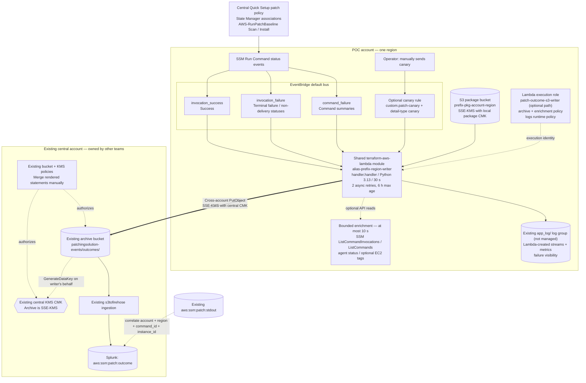

# Patch outcome architecture

A single-account, single-region Terraform root in `patching-failure/`. Patching
is owned by the centralized Quick Setup patch policy; this root only captures
outcomes. Examples use dummy account `222233334444` and a central bucket in
dummy account `111122223333`.

## Identity and dependencies

`iam.tf` creates one role with a fixed name and path, so that the central policies
can authorize it with `arn:<partition>:iam::*:role<path><name>`. The role carries
two inline policies: `archive`, which covers central S3/KMS writes and optional
SSM/EC2 reads, and `runtime`, which lets Lambda create log streams in the existing
`app_log/` group.

The shared Lambda module is used unchanged. It prefixes the function name with
the account alias, which must exist and keep the name within 64 characters. It
deploys only from S3, so this root creates an SSE-KMS package bucket. The log
group is looked up with a data source, so the plan fails if `app_log/` is
missing. Bucket protection and both IAM policies are created before the function, and the
EventBridge targets follow the function and its async configuration. IAM
propagation can still require AWS retries during the first apply.

## Outcomes and delivery

| Record | Meaning |
|---|---|
| `invocation`, `patched` | An **Install** invocation returned Success; verify actual compliance and reboot state separately. |
| `invocation`, `scanned` | A **Scan** invocation returned Success; no installation is implied. |
| `invocation`, `failed` | Aggregate invocation details establish failure or execution timeout. |
| `invocation`, `not-attempted` | Explicit termination by error threshold or a non-delivery/targeting status. |
| `invocation`, `unknown` | Operation or execution stage is unresolved. Cancellation alone does not prove non-execution. |
| `command` | Command-level context; never counted as an instance outcome. |
| `canary` | Synthetic pipeline check; never counted as patch activity. |

SSM service events use [best-effort delivery](https://docs.aws.amazon.com/eventbridge/latest/ref/events-ref-ssm.html).
Nothing reconciles missed events. Duplicate delivery is possible; repeated
writes use the same event-based key, and Splunk deduplicates on event ID. A
canary proves downstream delivery once its event is found in Splunk; it does not
prove that real SSM event patterns match.

## Planned enhancement: dead-letter queues

The code is kept commented out in `main.tf`, `iam.tf` and `outputs.tf`, marked
`ENHANCEMENT (DLQ)`. When restored, it adds:

- an EventBridge target DLQ holding the original event when a target cannot invoke the Lambda;
- a Lambda async on-failure destination holding an invocation record with `requestPayload`;
- a queue policy scoped to these rules and account, plus a `sqs:SendMessage` grant.

Both queues come from the shared `terraform-aws-sqs` module with 14-day
retention. Restoring them adds 3 resources.

## Deployment boundary

`rules_enabled` defaults to `false`. The canary rule is enabled when created, but
there is no schedule; an operator sends the event by hand. No custom metrics,
alarms, SNS topics, queues, central resources or bucket notifications are created.
Packages, retained logs, requests and any KMS usage can incur charges even while
SSM rules are disabled.

See [BUILD-INSTRUCTIONS-infrastructure.md](BUILD-INSTRUCTIONS-infrastructure.md)
for deployment and tests, [PAYLOAD-SPEC-patch-outcome-record.md](PAYLOAD-SPEC-patch-outcome-record.md)
for the record contract, [central-prerequisites/README.md](central-prerequisites/README.md)
for cross-account access and replay, and [splunk/README.md](splunk/README.md)
for parsing, correlation and acceptance.
