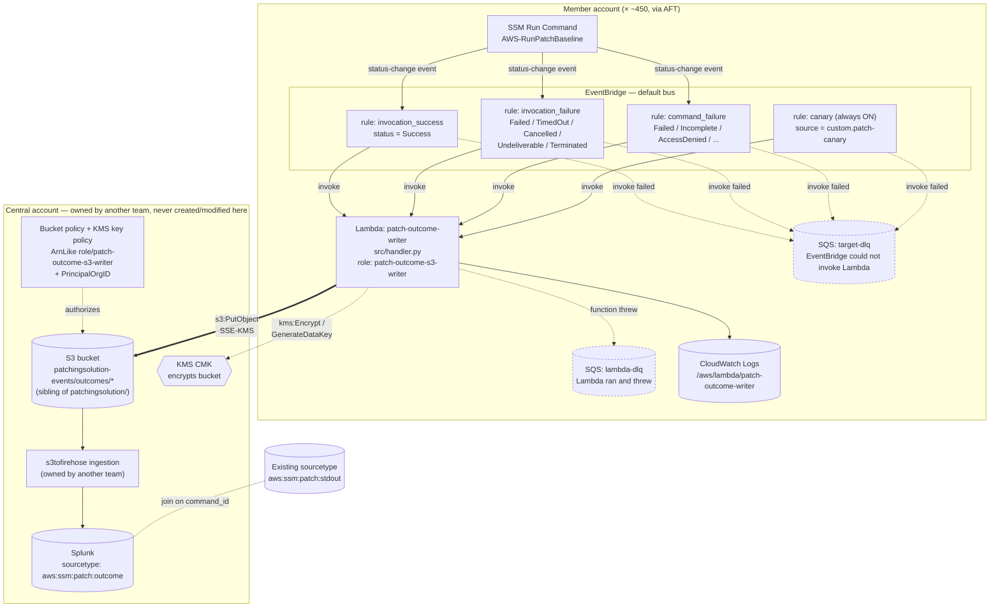

# Architecture Diagram

Deployed once per region, per member account (~450 accounts via AFT). The
central account (right side) is owned by another team and is never
created or modified by this module — only referenced.

## Reading the diagram

- **Solid arrows** are the happy path: SSM event → rule → Lambda → S3 →
  Firehose → Splunk.
- **Dashed arrows** are the failure/side paths: a target DLQ catches
  EventBridge-can't-reach-Lambda, a Lambda DLQ catches
  Lambda-ran-and-threw, and the canary proves the whole chain without
  needing a real SSM event.
- The **only cross-account call** is the Lambda's `s3:PutObject` (and the
  paired KMS encrypt calls) into the central bucket — everything else stays
  inside the member account.
- Nothing in the `CENTRAL` box is created by this Terraform module. The
  module only *renders* the two policy statements
  (`central_prerequisites` output) that the bucket owner merges by hand.
- `rules_enabled = false` disables `R1`/`R2`/`R3` (dashed in a live diagram
  would represent "DISABLED state"); `RC` (the canary) always stays
  `ENABLED` regardless.

See `HOW-IT-WORKS.md` for the narrative walkthrough of each step, and
`PAYLOAD-SPEC-patch-outcome-record.md` for what actually lands in the
bucket.
