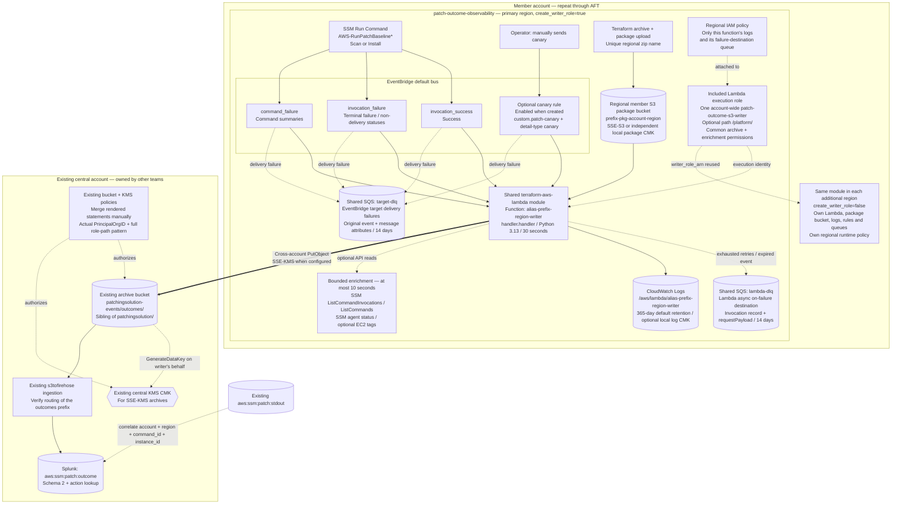

# Patch outcome architecture

Use `patch-outcome-observability` for each patching region. The first deployment
creates the Lambda execution role within that module; additional regions reuse it. The example uses two dummy members (`222233334444`,
`333344445555`), two regions, and an existing central bucket in dummy account
`111122223333`. Repeat the same account customization independently across the
fleet. A single member-account Terraform state owns its identity and regions.

## Identity, regions and dependencies

The primary Lambda deployment owns exactly one role and its common S3/KMS/SSM/EC2
policy in `iam.tf`. No separate account module or repository is needed. Its role
name and path are consistent across the fleet. Additional regional deployments
set `create_writer_role=false` and receive the primary output `writer_role_arn`;
each attaches a uniquely named runtime policy for its log group and Lambda failure
destination. Keep common archive/enrichment settings consistent across regions. IAM inline-policy
size limits still apply to the shared role; review policy size when expanding
to many regions.

The shared Lambda and SQS source modules are consumed unchanged. They prefix
names with the member account alias, which must exist and fit AWS name limits.
The Lambda input includes region so the shared module's local zip filenames
also differ in a two-region root. Package buckets are created in each Lambda's
region. Terraform establishes bucket protection/encryption and execution
permissions before making targets available. IAM propagation may still require
AWS retries during deployment.

## Outcomes and delivery

| Record | Meaning |
|---|---|
| `invocation`, `patched` | An **Install** invocation returned Success; verify actual compliance and reboot state separately. |
| `invocation`, `scanned` | A **Scan** invocation returned Success; no installation is implied. |
| `invocation`, `failed` | Aggregate invocation details establish failure or execution timeout. |
| `invocation`, `not-attempted` | Explicit termination by error threshold or a non-delivery/targeting status. |
| `invocation`, `unknown` | Operation or execution stage is unresolved. Cancellation alone does not prove non-execution. |
| `command` | Command-level context; never counted as an instance outcome. |
| `canary` | Synthetic pipeline check; never counted as patch activity. |

The handler writes flat, newline-terminated JSON with schema version 2,
`event_id`, `operation`, original event identity, status and optional context.
SSM invocation events often omit command parameters, so successful runs may
need a cached `ListCommands` call to distinguish Scan from Install. Metadata
is cached for fifteen seconds per Lambda environment; environments do not
share their caches. S3 failures propagate for Lambda retries.

SSM service events use [best-effort delivery](https://docs.aws.amazon.com/eventbridge/latest/ref/events-ref-ssm.html).
This design has no reconciliation poller: an event never received by EventBridge
cannot be recovered by either queue. Duplicate delivery is possible; repeated
writes use the same event-based key, and Splunk deduplicates event IDs/counts.
A canary proves downstream delivery only after its event is found in Splunk;
it does not prove that real SSM event patterns match.

## Deployment boundary

`rules_enabled` defaults to `false`. Creating the optional canary leaves its
rule enabled, but there is no schedule; an operator sends the event manually.
No custom metrics, alarms, SNS, central resources or bucket notifications are
created. Existing ingestion is reused and its outcomes-prefix routing is verified.
Packages, retained logs, requests, and any KMS usage can incur charges even
while SSM rules are disabled.

Use [BUILD-INSTRUCTIONS-infrastructure.md](BUILD-INSTRUCTIONS-infrastructure.md)
for deployment/tests, [PAYLOAD-SPEC-patch-outcome-record.md](PAYLOAD-SPEC-patch-outcome-record.md)
for the record contract, [central-prerequisites/README.md](central-prerequisites/README.md)
for cross-account access and queue replay, and [splunk/README.md](splunk/README.md)
for parsing, correlation and pilot acceptance.
